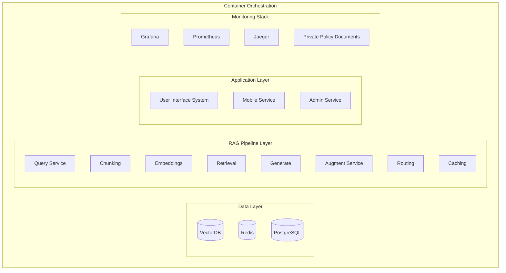

# AI Agent

與 agent 溝通時, 務必永遠留意到:

- context
- model
- prompt
- tools
- flow

## AI 近年來演進 ~ 2026Q2

- Prompt Engineering
  - 模型有沒有聽懂
- Context Engineering
  - 模型有沒有拿到正確訊息
- Harness Engineering
  - 模型能不能持續交付有品質的產出

> LangChain 工程師給了一個定義:
> 
> Agent = Harness + Model
> 
> Harness = Agent - Model
 
- Agent 團隊內部一位很優秀的人員
- Harness 團隊的工作流程及業務邏輯
- Model 很優秀的人, 但不熟團隊運作


# RAG 架構 - 例外處理實作範例

```python
def get_reply(query: str):
  try:
    # Try full RAG pipeline
    return rag_pipeline(query)
  except VectorDBError:
    # Fallback to keyword search
    return keyword_search(query)
  except LLMError:
    # Return retrieved chunks directly
    return format_retrieved_chunks(query)
  except EmbeddingError:
    # Use simple text matching
    return text_search(query)
  except Exception:
    return "Service temporarily unavailable. Please try again later."
```



## Good Prompt usage to create AGENTS.md & CLAUDE.md

```
連結為一套名為「Karpathy Skills」的開發規範。請從以下網址取得檔案：https://raw.githubusercontent.com/forrestchang/andrej-karpathy-skills/refs/heads/main/CLAUDE.md
這份 CLAUDE.md 包含四大核心原則（先思考後動手、簡約優先、精確異動、目標導向執行），旨在優化你處理程式碼的方式。
請注意，切勿覆蓋現有的 CLAUDE.md (or AGENTS.md or GEMINI.md) 檔案(視 Model 預設會載入哪個為主)。若檔案已存在，請將這四項原則合併進去——請以新增區塊的方式處理，不得刪除或改動既有內容。若專案中尚未建立 CLAUDE.md/AGENTS.md/GEMINI.md，請直接將檔案存入專案根目錄。完成後，請重新讀取檔案並向我確認目前已生效的原則。 最後，請針對如何將這套規範完美整合至我們的開發流程中提出建議。
```
