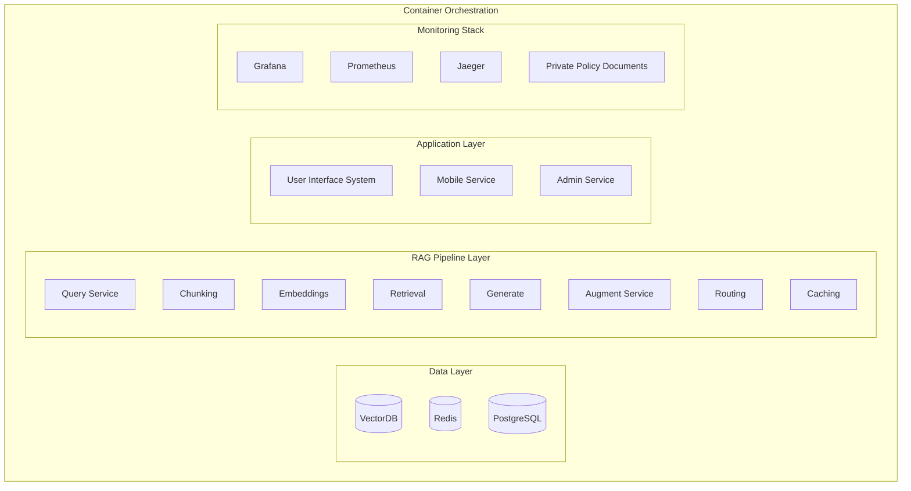

# AI Agent

與 agent 溝通時, 務必永遠留意到:

- context
- model
- prompt
- tools
- flow


# RAG 架構 - 例外處理實作範例

```python
def get_reply(query: str):
  try:
    # Try full RAG pipeline
    return rag_pipeline(query)
  except VectorDBError:
    # Fallback to keyword search
    return keyword_search(query)
  except LLMError:
    # Return retrieved chunks directly
    return format_retrieved_chunks(query)
  except EmbeddingError:
    # Use simple text matching
    return text_search(query)
  except Exception:
    return "Service temporarily unavailable. Please try again later."
```

