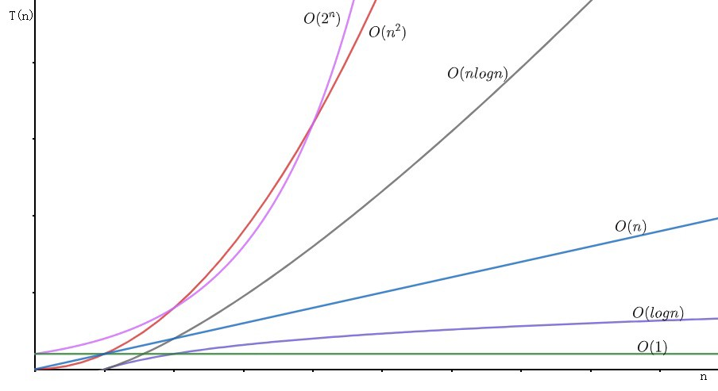

# Algorithms 演算法

```
            Union-Find（Disjoint Set）
                    ↓
          ┌────────────────────────┐
          ↓                        ↓
     Quick-Find                Quick-Union
          ↓                        ↓
     Weighted Quick-Find     Weighted Quick-Union
                                   ↓
                   Weighted Quick-Union + Path Compression
```

# Legacy Notes

> 執行次數 = 漸進時間複雜度(asymptotic time complexity)
>
> 時間複雜度, 表示為: `T(n) = O(f(n))` <--- 演算法著重於這個
>
> 空間複雜度, 表示為: `S(n) = O(f(n))`
>
> 程式執行的時間 = O(程式執行次數的總和)

判斷重點:

1. 用常數 1 取代執行時間中的所有加法常數
2. 只保留最高項次
3. 忽略最高項次的常數

> 耗時程度(小到大):
>
> O(1) < O(logN) < O(N) < O(NlogN) < o(N^2) < o(N^3) < O(2^N) < O(N!) < O(N^N)


