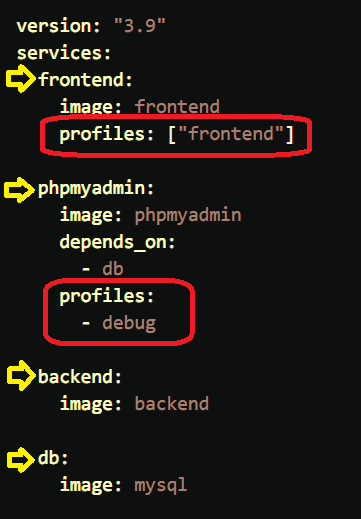

- [在 Docker Compose file 3 下限制 CPU 與 Memory](https://blog.yowko.com/docker-compose-3-cpu-memory-limit/)


```bash
### v3 以上的 compose 指定資源限制, 需加上 --compatibility
docker-compose --compatibility up -d
```


## profiles



```bash
### 只用來啟動特定的 profile
docker-compose --profile debug up
docker-compose --profile frontend --profile debug up
COMPOSE_PROFILES=debug docker-compose up
COMPOSE_PROFILES=frontend,debug docker-compose up
```