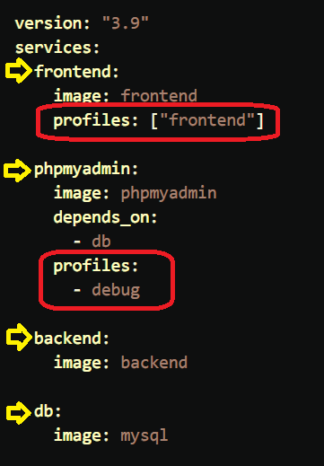

## profiles

- 2023/05/15
- [Using profiles with Compose](https://docs.docker.com/compose/profiles/)

- 這東西說穿了, 可以理解成 tags 或是 labels

```bash
### 只用來啟動特定的 profile
docker-compose --profile debug up
docker-compose --profile frontend --profile debug up
COMPOSE_PROFILES=debug docker-compose up
COMPOSE_PROFILES=frontend,debug docker-compose up
# 可使用 環境變數 COMPOSE_PROFILES 做安排
```
