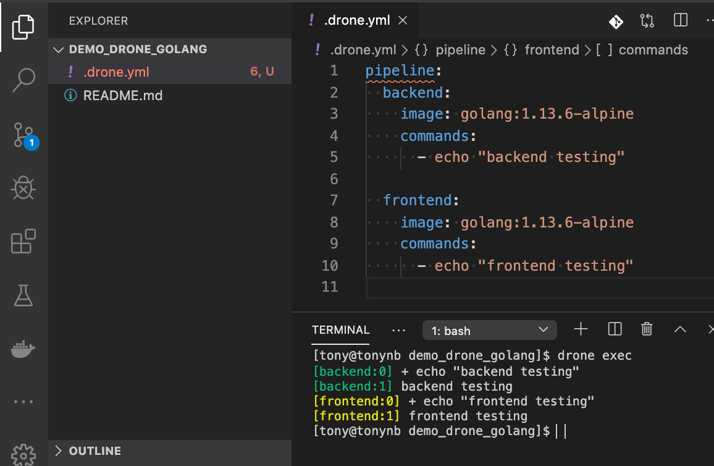

# DevOps

- 2020/01/23

## Ngrok

```bash
$# ngrok http -host-header=rewrite <DOMAIN HEADER>:<PORT>
ngrok http -host-header=rewrite mydrone.com:8081
```

## GitLab

> User Setting > Applications > Redirect URI 填入 `https://DRONE_HOST/login`
  DRONE_HOST 可使用 ngrok 來做本地測試, 我使用 `ngrok http -host-header mydrone.com 17777`

Scopes 選擇 `api` && `read_user`, 取得底下:

- Application ID:
- Secret:

填入 `.docker-compose.yml` 對應的 GitLab 環境變數對應的 CLIENT && SECRET

## Drone

### Install drone CLI

- https://docs.drone.io/cli/install/

```bash
### Macbook
curl -L https://github.com/drone/drone-cli/releases/latest/download/drone_darwin_amd64.tar.gz | tar zx
sudo cp drone /usr/local/bin
```

在存有 `.drone.yml` 的地方使用 `drone exec`, 就算沒有 drone server, 依舊可以執行測試



### Install drone by compose (Server && Agent)


Drone 基於 Container 的 CI/CD 系統(所有流程都在 Docker Container). Git push 後, 驅動 Drone 開始執行 (都在 Docker 內)

- Git Clone
- Test
- Package
- Deploy
- Send Message

使用 `.drone.yml` 做組態控制

---

drone 0.8 版以後, 拆成: `drone-server` && `drone-agent`


# Usage

1. ngrok http -host-header=rewrite mydrone.com:8081
2. 把 Forwarding 貼到 Gitlab User Settings > Applications > [PROJECT_NAME](替換 Callback URL)
3. 替換 .env 的 DRONE_SERVER_HOST
4. export `DRONE_GITLAB_CLIENT_ID` && `DRONE_GITLAB_CLIENT_SECRET`
5. docker-compose up
6. http://mydrone.com:8081


```bash
### https://gist.github.com/danielepolencic/2b43329495d018dc6bfe790a79b559d4
export DRONE_SERVER=https://8d903309.ngrok.io  # Ngrok 的 public domain
export DRONE_TOKEN=XXXXX  # Drone Server 的 Personal Token

### 若成功的話, 表示正確連到 Drone Server 了
$# drone info
User: cool21540125
Email: cool21540125@gmail.com
```
