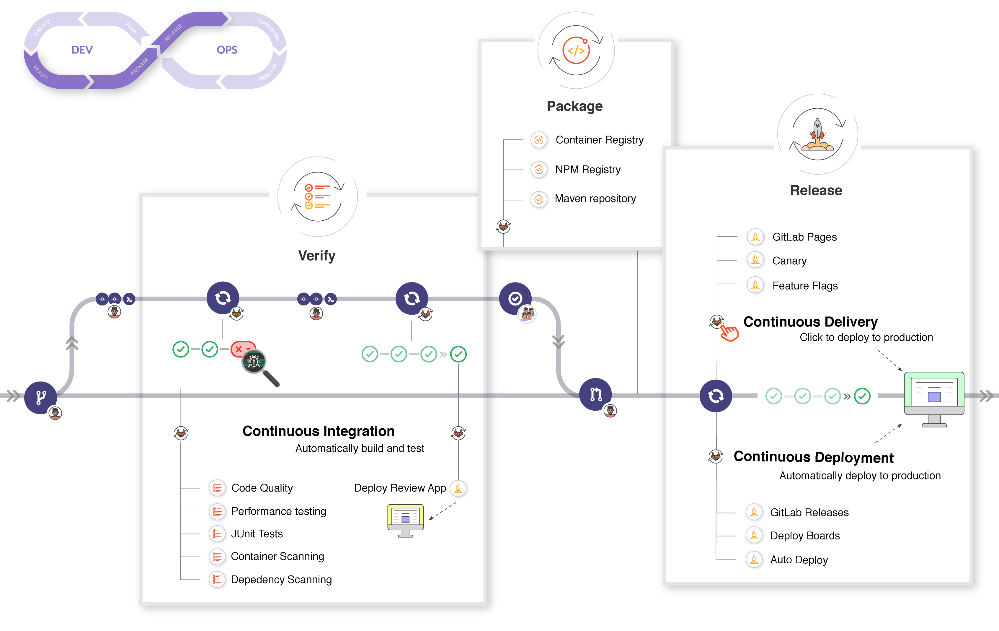

# [Getting started with GitLab CI/CD](https://gitlab.com/help/ci/quick_start/README)



- 2018/10/30

1. 專案根目錄放置 `.gitlab-ci.yml`
2. 設定 GitLab Project 使用 Runner
3. 每次 commit 或 push, 都會觸發 `CI pipeline`(出現在 `CI/CD / Pipelines`)


## .gitlab-ci.yml

定義 `GitLab Runner` 要怎麼作, 基本上處理流程為

1. build
2. test
3. deploy

上述的流程, 如果裡頭沒有 job, 會被忽略掉(ex: 不作 test, 就不要在 test 階段安排 job)

以上如果沒問題, 會得到 `nice green checkmark`


# .gitlab-ci.yml 範例

* https://docs.gitlab.com/ee/ci/yaml/

```yml
# 所有 job 起始前先執行
before_script:
    - apt-get update -qq && apt-get install -y -qq sqlite3 libsqlite3-dev nodejs
    - ruby -v
    - which ruby
    - gem install bundler --no-ri --no-rdoc
    - bundle install --jobs $(nproc) "{FLAGS[@"

# 第一份 job, 名為 rspec
rspec:
    script:
        - bundle exec rspec     # 執行的指令

# 第二份 job, 名為 rubocop
rubocop:
    script:
        - bundle exec rubocop   # 執行的指令
```

Jobs are used to create jobs, which are then picked by Runners and executed within the environment of the Runner.

把 `.gitlab-ci.yml` 也 push 到 GitLab 後, pipeline 就會被掛起來(啟用)了~~


# Runner

A Runner can be a ...
- virtual machine
- VPS
- bare-metal machine
- a docker container
- a cluster of containers

> Gitlab 及 Runners 透過 API 作溝通, 所以, `Runner's machine` 必須要提供 GitLab Server `network access`

Runner 不僅可提供給單一專案, 也可同時用來給多個專案(稱為 *Shared Runner*)


## 如何設定 Runner

Ans: 專案 > Settings > CI/CD
