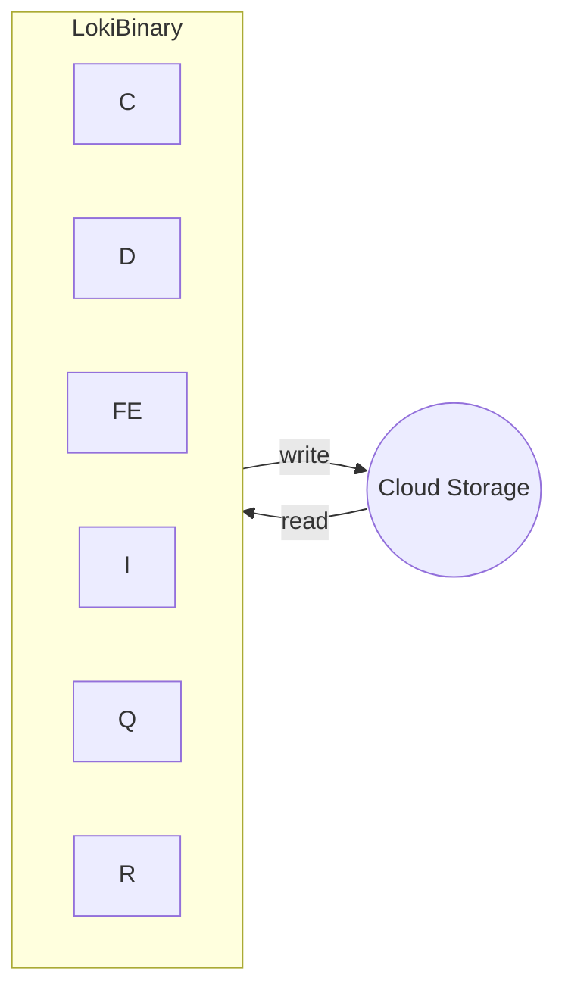

# Loki - docker compose - Monolithic Deployment Mode 架構 (沒啥營養, 看看就好)

https://raw.githubusercontent.com/grafana/loki/main/examples/getting-started/docker-compose.yaml

| abbr | Components     |
| ---- | -------------- |
| C    | Compactor      |
| D    | Distributor    |
| FE   | Query frontend |
| I    | Ingester       |
| Q    | Querier        |
| R    | Ruler          |

