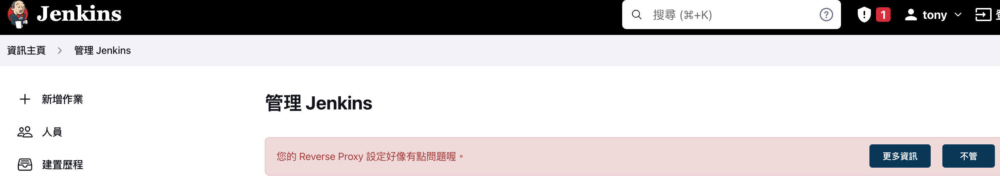
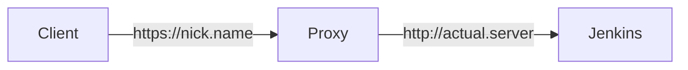

- [Reverse proxy - Issues](https://www.jenkins.io/doc/book/system-administration/reverse-proxy-configuration-troubleshooting/)
- [Reverse proxy - Nginx](https://www.jenkins.io/doc/book/system-administration/reverse-proxy-configuration-nginx/)

常常 Jenkins 起起來以後, 常會看到底下這樣. 此篇說明原因及解法

原文: `It appears that your reverse proxy setup is broken`

(如果不鳥他, 好像也不會有啥問題!?)

此問題的架構如下

- 發生此類問題最常見的情況如下:
    - Proxy 沒有改寫 Response Header 裡頭的 `Location: xxx`
    - Proxy 沒有設置好 Request Header 裡頭的:
        - `X-Forwarded-Host: xxx`
        - `X-Forwarded-Port: xxx`
        - `X-Forwarded-Proto: xxx`
