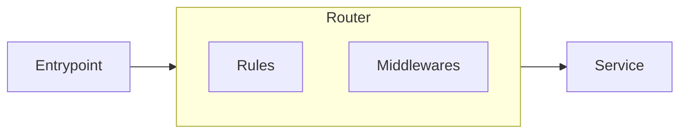
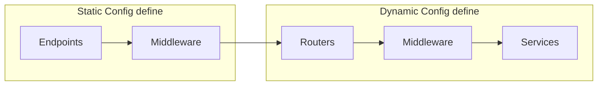

- [Domain not redirecting to Traefik dashboard](https://community.traefik.io/t/domain-not-redirecting-to-traefik-dashboard/9420/3)

# traefik

- 必須要先建立 `docker network create net_traefik`
- 之後的容器網路都必須要有這個
- 個別容器必須要做 expose 或 ports mapping

# traefik Architecture && Workflow

- Entrypoint 預設監聽 80 & 443, 可藉由像是 `--entrypoints.web.address=:80` 做額外配置
- Rules 可針對底下的這些來做不同路由
    - Protocol
    - Host
    - Path
    - Header
    - custom
- middleware 不外乎可以做底下這些, 可藉由 plugin 來做額外擴充
    - auth
    - rate limit
    - modify headers
    - custom

----------------------------------------

- Static Config 的設定為 global, 直接套用全域

----------------------------------------
