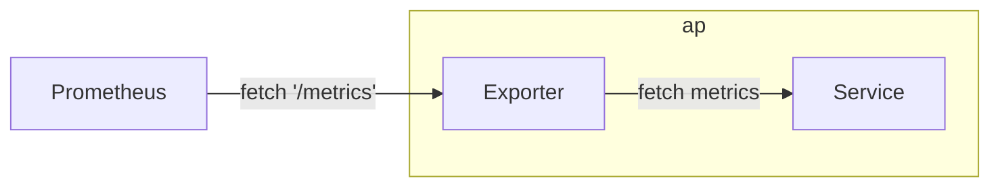
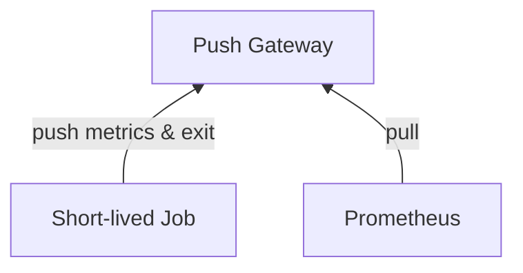

# Prometheus

- 使用 `Prometheus query language, PromQL)` 從 k8s 來 filter, aggregate, ingest, and query time series metrics.
- Prometheus 主要有 3 個元件:
    - Retrieval
        - 到處去 pull metrics data, 並存入 TSDB
    - TSDB
    - HTTP Server
        - 提供 API Endpoints
        - 由 TSDB 撈東西後回傳給 Client
    ```mermaid
    flowchart RL

    subgraph Prometheus
        Retrieval
        TSDB
        http["HTTP Server"]
    end

    ui["Prometheus UI"] -- PromQL --> http;
    Grafana -- promQL --> http;
    ```
- Endpoints
    - '/metrics'
    - '/federate'
        - 讓 Prometheus 可以串 Prometheus
    - '/graph'
        - GUI 介面


## Exporter

- 讓 Prometheus scraping metrics 的 AP
- Exporter 可視為是 Service 的 Sidecar




## Push Gateway Component




## Alertmanager


