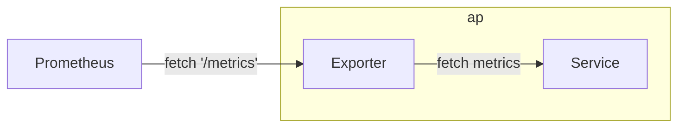
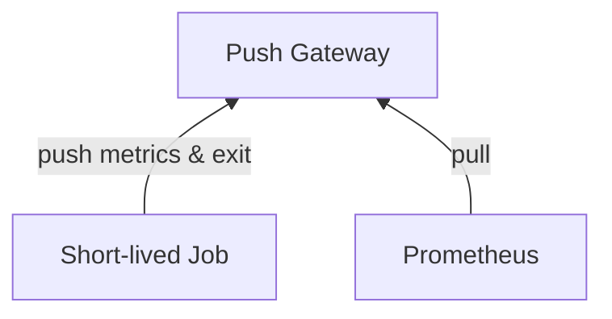
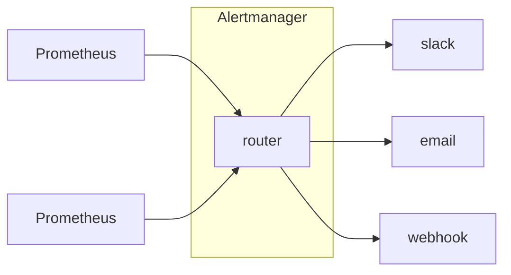

# Prometheus

- Prometheus server 對 agent 做 pull metrics. Agent 揭露 監控物件的方式如下:
    - via 設定檔, 文字檔 做靜態配置
    - 支援 ZooKeeper, Consul, Kubernetes 等方式進行 動態發現(Auto Discovery)
- 使用 `Prometheus query language, PromQL)` 從 k8s 來 filter, aggregate, ingest, and query time series metrics.
- Prometheus 主要有 3 個元件:
    - Retrieval
        - 到處去 pull metrics data, 並存入 TSDB
    - TSDB
    - HTTP Server
        - 提供 API Endpoints
        - 由 TSDB 撈東西後回傳給 Client
    ```mermaid
    flowchart RL

    subgraph Prometheus
        Retrieval
        TSDB
        http["HTTP Server"]
    end

    ui["Prometheus UI"] -- PromQL --> http;
    Grafana -- promQL --> http;
    ```
- Endpoints
    - '/metrics'
    - '/federate'
        - 讓 Prometheus 可以串 Prometheus
    - '/graph'
        - GUI 介面


## Exporter

- Prometheus 對於不同 Middleware 開發了許多 監控代理, ex:
    - Kafka exporter
    - MySQL server exporter
    - Apache exporter
    - Redis exporter
    - Node exporter
- 讓 Prometheus scraping metrics 的 AP
- Exporter 可視為是 Service 的 Sidecar




## Push Gateway Component

- Prometheus 基本上是透過 pull 拉 metrics, 但為了與 採用 push 監控系統連線, 則可使用 **PushGateway**.
    - 系統主動發送 metrics 到 PushGateway, Prometheus 再來 pull




## AlertManager

- 用來協助 Prometheus 發送警告資訊
    - 獨立於 Prometheus 的元件
    - 本身支援 HA
- AlertManager 之間避免重複警告, 彼此間引用了 Gossip 來同步 警告資訊



