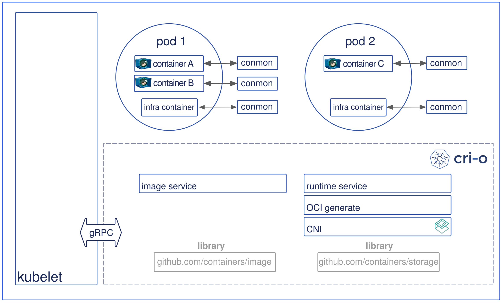

- [為什麼使用 Kubernetes](https://blog.gcp.expert/kubernetes-gke-introduction/)
- [Learn Kubernetes Basics](https://kubernetes.io/docs/tutorials/kubernetes-basics/)
- [k8s-30天](https://ithelp.ithome.com.tw/articles/10192401)
- [raft演算法(去中心化)-超簡明解說](http://thesecretlivesofdata.com/raft/)


# 縮寫

```sh
alias k=kubectl
k get svc     # service
k get cj      # cronjob
k get po      # pods
k get ns      # namespace
k get deploy  # deployment
k get no      # nodes
k get cm      # configmap
k get rs      # replicaset
```


# K8s Interface

k8s 只有制定了 3 個介面

- CRI, 容器運行介面
- CNI, 容器網路介面
- CSI, 容器儲存介面


# 一些必要名詞之間的定義 && 釐清

K8s 平台的選擇:

- Bare Metal
- Cloud
  - GCP - Google GKE
  - AWS - Amazon EKS
  - Azure - Azure AKS
- 平台供應商(都會包裝 Bare Metal)
  - RedHat OpenShift
  - VMware Tanzu
  - Rancher : 三者中較為便宜


# 架構


- Kubernetes Master
  - etcd
  - API Server
  - Controller Manager Server
    - 確保 Cluster 之中的 desired state 與 actual state 一致
    - 協調發布狀態最終一致的元件
  - Scheduler
    - 將 pod 安排到適當的 Node(找出誰比較閒, 然後叫他去做事情)
- Kubernetes Worker
  - kubelet
    - 可以視為 kubernetes agent (也就是 worker 的 daemon 啦)
    - worker 的資源管理者
    - 等候 API Server 發布施令 && 回報給 API Server 節點資訊
  - container runtime
    - 實作 CRI 的服務, ex: cri-o
  - kube-proxy
    - 對外提供 service

---


### Container Runtime Interface(CRI)

- k8s 用來與 Container 溝通的介面. 預設會依照底下去尋找 (這知識可能過期了):
  - Docker: /var/run/docker.sock  (Docker 內建的 CRI 實作為 `dockershim`, 與 kubelet 於 18.09 整合起來了)
  - containerd: /run/containerd/containerd.sock
  - CRI-O: /var/run/crio/crio.sock


So far, 2021/10/30, k8s 以使用 CRI-O 來實作 CRI

配置 control-plane node 上面 kubelet 需要使用的 cgroup driver

若使用的是 Docker, kubelet 會自動偵測 cgroup driver, 並於 Runtime 期間設定於 `/var/lib/kubelet/config.yaml`


# kubernetes CRI 架構演進圖

```
kubelet -> Dockershim              -> Docker Engine -> Containerd -> Containerd-shim -> runC/Crun  -> container
kubelet -> CRI-Containerd          ->                  Containerd -> Containerd-shim -> runC/Crun  -> container
kubelet -> Containerd + CRI Plugin ->                                Containerd-shim -> runC/Crun  -> container
kubelet -> CRI-O                                                                     -> runC/Crun  -> container
           ^^^^^^^^^^^^^^^^^^^^^^^^^^^^^^^^^^^^^^^^^^^^^^^^^^^^^^^^^^^^^^^^^^^^^^^^^    ^^^^^^^^^
                          Container Runtime Interface, CRI                              OCI runtime
```



- Pod 裡頭共享著相同的 PID, NET, IPC namespace. 並且存在於相同的 cgroup
- CRI-O 專門為 k8s 設計, CRI 隨著演進, 減少了許多 IPC 之間的開銷
- cri-o
  - 使用 `containers/image` library 來做 image pull & push
  - 使用 `containers/storage` library 來將 pull 下來的 image 做 unpack 到 root-filesystem && 儲存到 COW file system
  - OCI-based implementation of Kubernetes Container Runtime Interface
- Open Container Initiative, OCI


# k3s

- 內建 Ingress
- 內建 Dynamic Volume Provision


# 未整理

- k8s service 的 CLUSTER-IP 不會變動; 而 pod IP 可能會變動
- k8s apply vs create
  - The key difference between kubectl apply and create is that apply creates Kubernetes objects through a declarative syntax, while the create command is imperative.
  - kubectl apply : declarative syntax, 可用來改變已 deploy 的規格 && 也可用來首次建立
  - kubectl create : imperative, 只能用來首次建立
- HPA Controller, Horizontal Pod Autoscaler
  - 用來實現以 CPU 為基礎的 自動 Pod 容量調整機制 
    - 可以讓 k8s auto-scaling Pods 啦
  - 細節
    - HPA, 可在 **kube-controller-manager**
      - `--horizontal-pod-autoscaler-sync-period` 來調整探測週期
      - `--horizontal-pod-autoscaler-tolerance` 調整 autoscaling 指標的容忍(不作變動)區間
    - 早期使用 Heapster 元件來搜集, v1.11 以後改用 Metrics Server 來搜集 Pods 的性能指標
      - 藉由 Aggregated API, ex: metrics.k8s.io, custom.metrics.k8s.io, external.metrics.k8s.io
    - 目前有 2 個版本
      - `autoscaling/v1`, 僅支援 CPU metrics
      - `autoscaling/v2`, 額外增加 Memory, custom, external metrics, 並且可使用多指標 (直接用這個就對了?)
