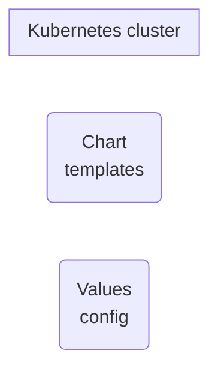

# KUBEAPPS

- 2022/12/02
- [Your Application Dashboard for Kubernetes](https://kubeapps.dev/)

```bash
$# helm repo add bitnami https://charts.bitnami.com/bitnami
$# helm install \
    -n kubeapps \
    --create-namespace \
    kubeapps bitnami/kubeapps

$# kubectl create \
    --namespace default \
    serviceaccount kubeapps-operator

$# kubectl create clusterrolebinding kubeapps-operator \
    --clusterrole=cluster-admin \
    --serviceaccount=default:kubeapps-operator

$# cat <<EOF | tee /tmp/secret.yaml
apiVersion: v1
kind: Secret
metadata:
  name: kubeapps-operator-token
  namespace: default
  annotations:
    kubernetes.io/service-account.name: kubeapps-operator
type: kubernetes.io/service-account-token
EOF
$# kubectl apply /tmp/secret.yaml
secret/kubeapps-operator-token created


### 生成 token
$# kubectl get --namespace default secret kubeapps-operator-token -o go-template='{{.data.token | base64decode}}'

### 本地端口暴露
$# LOCAL_PORT=
$# kubectl port-forward -n kubeapps svc/kubeapps ${LOCAL_PORT}:80
# 瀏覽器訪問 http://localhost:{LOCAL_PORT}
```
