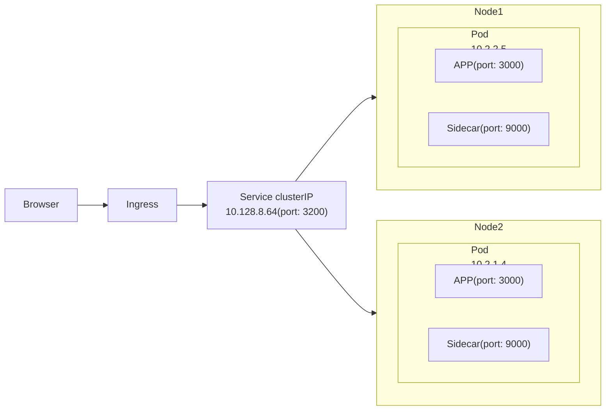

k8s 的 Pods 都有它自己的 IP (ephemeral), Pod 隨時死給你看, IP 隨時可能會變動

- Service 有一組 Static IP, 用來讓 User 與 Service 後面的 Pods 做通訊
    - User 不用鳥 Pods 死活, Service 會幫忙通訊就對了
    - ReplicaSet 會協助幫掛掉的 Pods 抓交替

# k8s service

Kubernetes 有底下 4 種常見的 Service Types:

## type: ClusterIP

- 此為 default service type
- Exposes the service on a cluster-internal IP. Choosing this value makes the service only reachable from within the cluster.
- 可指定 1~N 個 Node IP, 用來提供服務 (自動映射到 ClusterIP)

## type: NodePort

- 可將 Cluster Port 映射到 宿主機的 port (宿主機防火牆開了以後, 可對外提供服務)
- 會對所有的 Nodes 都對外提供服務
- Port 可用範圍為 30000-32767
- Exposes the service on each Node’s IP at a static port (the NodePort). A ClusterIP service, to which the NodePort service will route, is automatically created. You’ll be able to contact the NodePort service, from outside the cluster, by requesting <NodeIP>:<NodePort>.

## type: LoadBalancer

## type: Headless
