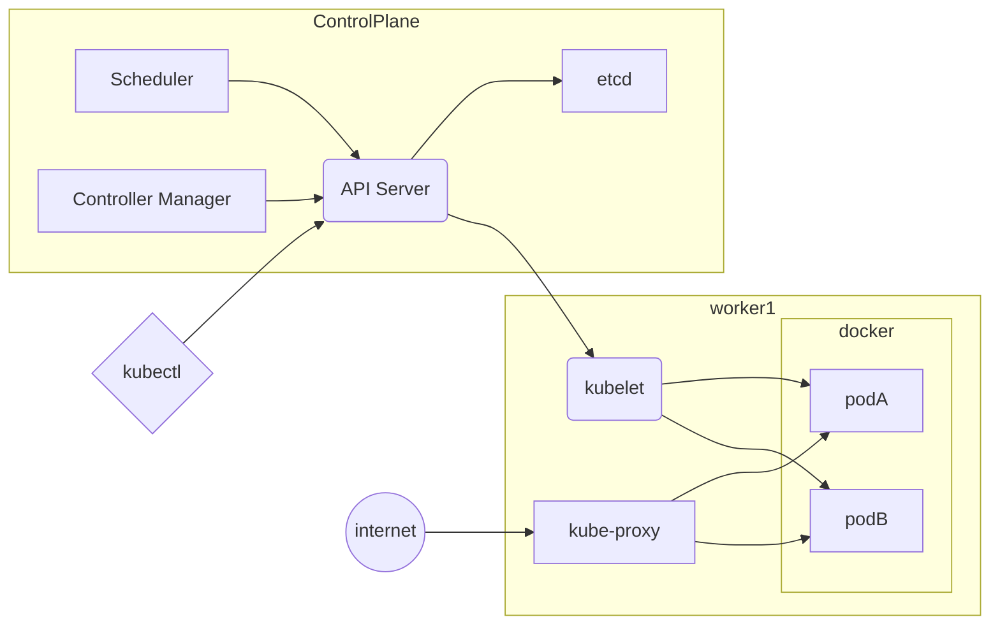
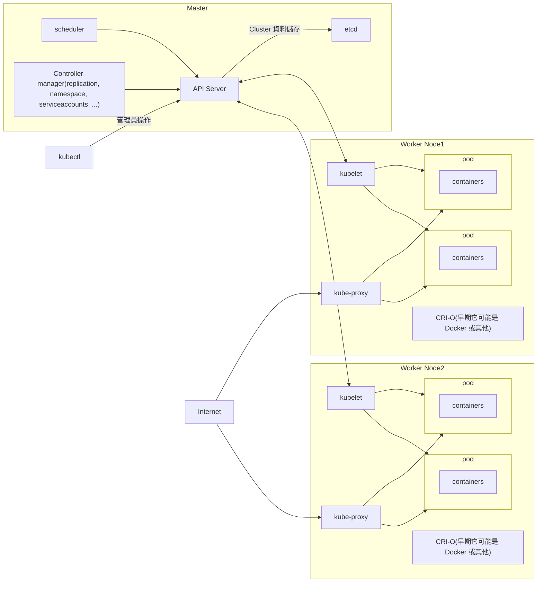

## 架構簡圖

```mermaid
flowchart LR

subgraph worker1
    kp["kube-proxy"]
    kt("kubelet")
    subgraph docker
        podA
        podB
    end

    kp --> podA; kp --> podB;
    kt --> podA; kt --> podB;
end

subgraph ControlPlane
    apisrv("API Server")
    apisrv --> etcd;
    Scheduler --> apisrv;
    cm["Controller Manager"] --> apisrv;
end

kl{"kubectl"} --> apisrv;
ii(("internet")) --> kp;
apisrv --> kt;
```

```mermaid
flowchart LR;

subgraph Master;
    scheduler --> api;
    api -- Cluster 資料儲存 --> etcd;
    cm["Controller-manager(replication, namespace, serviceaccounts, ...)"] --> api[API Server];
end

subgraph w1[Worker Node1];
    api <--> kubelet1[kubelet];
    kubelet1 --> pod1A[pod];
    kubelet1 --> pod1B[pod];
    kube-proxy1[kube-proxy] --> pod1A[pod];
    kube-proxy1[kube-proxy] --> pod1B[pod];
    crio2["CRI-O(早期它可能是 Docker 或其他)"];

    subgraph pod1A[pod];
        containers1A[containers];
    end
    subgraph pod1B[pod];
        containers1B[containers];
    end
end

subgraph w2[Worker Node2];
    api <--> kubelet2[kubelet];
    kubelet2 --> pod2A[pod];
    kubelet2 --> pod2B[pod];
    kube-proxy2[kube-proxy] --> pod2A[pod];
    kube-proxy2[kube-proxy] --> pod2B[pod];
    crio1["CRI-O(早期它可能是 Docker 或其他)"];

    subgraph pod2A[pod];
        containers2A[containers];
    end
    subgraph pod2B[pod];
        containers2B[containers];
    end
end

kubectl -- 管理員操作 --> api;
Internet --> kube-proxy1;
Internet --> kube-proxy2;
```