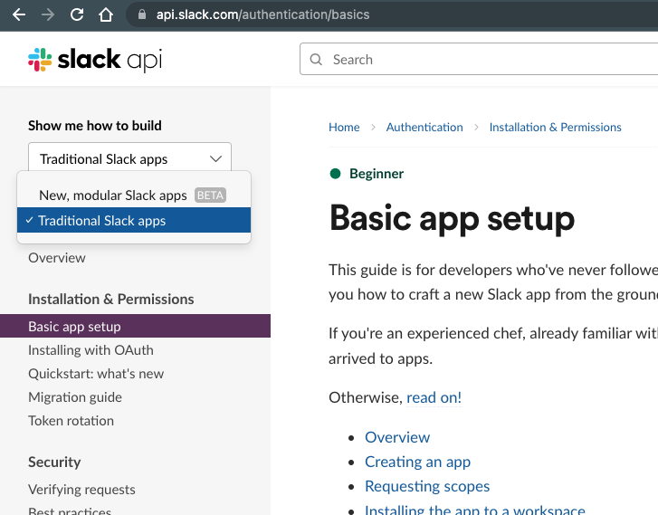
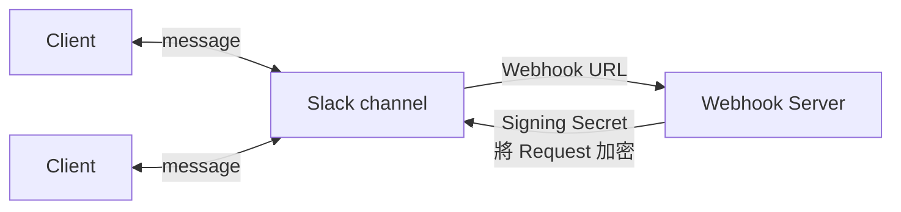
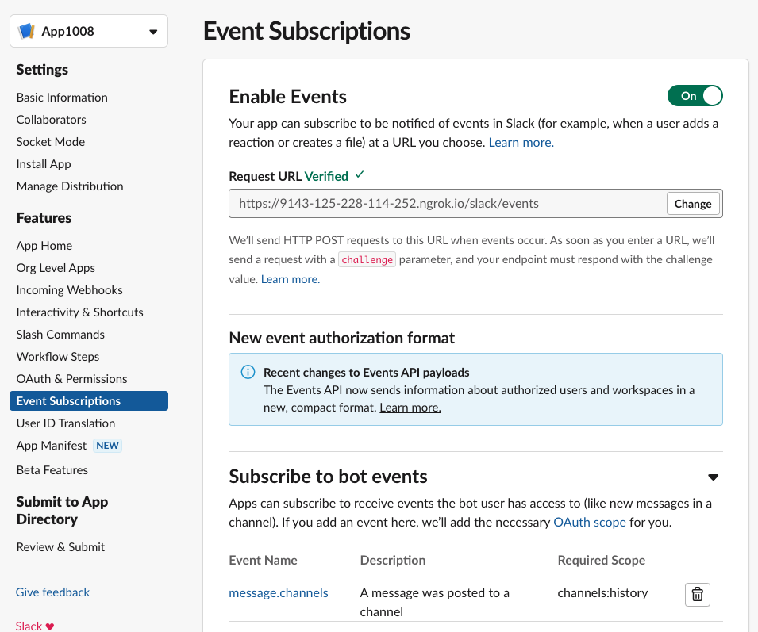

這篇裡頭預計會分成很多個部分來說明 Slack 的用途 & 使用方式

- [Setup & Sending Messages](#setup--sending-messages)
    - Slack 最最最基本的 POST Message
- [Handling Events (Event API)](#handling-events-event-api)
    - 請 Slack API 追蹤特定事件, 再將 Request POST 回 Webhook Server

# Setup & Sending Messages

2022/10 的現在, Slack 已有新一代的 Slack apps (目前仍為 Beta)

這篇聚焦在 Traditional Slack apps

### 在 workspace 裡頭建立 App

> 進入 [Traditional App](https://api.slack.com/apps) > Create an app > From scratch
> 
> App Name(自行輸入) > Pick a workspace(要把這個 App 塞到哪個 workspace) > Create App
> 
> (首次使用的話, 右上角) Your Apps > I Agree (總之就是 Slack 相關的同意條款啦)

### 設定 App token

- Learn about [Access tokens](https://api.slack.com/authentication/token-types)
- Slack App 具有這些 [Permission scopes](https://api.slack.com/scopes)

這邊目標是, 我們要去尻 `chat.postMessage` 這隻 API, 因此需要讓 App 具備必要權限~

> [Your Apps](https://api.slack.com/apps)  > Generate Token > 選擇 Workspace > Generate
> 
> 此時把剛產生好的 `Access Token` && `Refresh Token` (妥善保存)
> 
> 進入剛建好的 App > **Basic Information** > App Credentials 裡頭可看到一堆... (這是用來給 Slack App 存取 Slack API 用的)
> 
> `APP ID`, `Client ID`, `Client Secret`, `Signing Secret`, `Verification Token` (妥善保存)
> 
> **OAuth & Permissions** > **Bot Token Scopes / Add an OAuth Scope** > `chat:write`
> 
> **Install to Workspace** (將來如果異動權限, 都要做 **Reinstall to Workspace**)
> 
> 可看到 `Bot User OAuth Token` (妥善保存), 就拿這個 token 來尻 API 發消息了

### Slack Workspace

> 挑選一個看得順眼的 `#channel` 或是自建一個~
> 
> **About / Get channel details** > (最下面可看到) `Channel ID`
> 
> **Integrations / Get channel details** > **Add an App** > 把剛剛建好的 App 加入到此 channel
> 
> 然後盡情的去尻 [chat.postMessage](https://api.slack.com/methods/chat.postMessage) 吧~

# Handling Events (Event API)

### Example Code

看這個範例吧 https://github.com/cool21540125/learning_slack/tree/webhook

本地 Expose 出一個 Webhook URL

### 配置

> Your App 頁面 > **Event Subscriptions** > Enable Events
> 
> 填妥 `Request URL` (記得要有 suffix) > `challenge` 要能夠成功~

> 底下的 **Subscribe to bot events** > **Add Bot User Event** > `message.channels`
> 
> 前往 **OAuth & Permissions** > Scopes 底下要有 `channels:history` 及 `chat:write`
> 
> **Reinstall to Workspace**
> 
> Enjoy~
