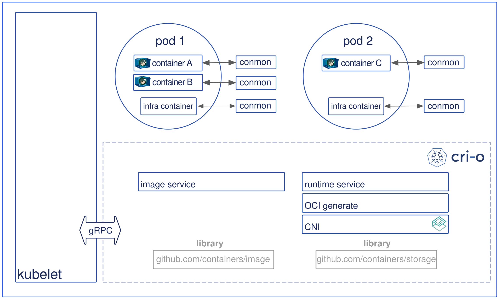

- [為什麼使用 Kubernetes](https://blog.gcp.expert/kubernetes-gke-introduction/)
- [Learn Kubernetes Basics](https://kubernetes.io/docs/tutorials/kubernetes-basics/)
- [k8s-30天](https://ithelp.ithome.com.tw/articles/10192401)
- [raft演算法(去中心化)-超簡明解說](http://thesecretlivesofdata.com/raft/)


# K8s Interface

k8s 只有制定了 3 個介面

- CRI, 容器運行介面
- CNI, 容器網路介面
- CSI, 容器儲存介面


# 一些必要名詞之間的定義 && 釐清

K8s 平台的選擇:

- Bare Metal
- Cloud
  - GCP - Google GKE
  - AWS - Amazon EKS
  - Azure - Azure AKS
- 平台供應商(都會包裝 Bare Metal)
  - RedHat OpenShift
  - VMware Tanzu
  - Rancher : 三者中較為便宜


# 架構


- Kubernetes Master
  - etcd
    - 儲存一堆元件的資訊及狀態: Nodes, Pods, Configs, Secrets, Accounts, Roles, Bindings, 
      - 像是使用 `kubectl get ...` 便是從中取得
    - k8s 儲存在 etcd 裡頭的結構, 會以 `/registry` 為 root directory
      - 而底下會有像是: minions, pods, replicasets, deployments, roles, secrets, ...
  - API Server
  - Controller Manager Server
    - 確保 Cluster 之中的 desired state 與 actual state 一致
    - 協調發布狀態最終一致的元件
  - Scheduler
    - 將 pod 安排到適當的 Node(找出誰比較閒, 然後叫他去做事情)
- Kubernetes Worker
  - kubelet
    - 可以視為 kubernetes agent (也就是 worker 的 daemon 啦)
    - worker 的資源管理者
    - 等候 API Server 發布施令 && 回報給 API Server 節點資訊
  - container runtime
    - 實作 CRI 的服務, ex: cri-o
  - kube-proxy
    - 對外提供 service

------------------------------------------------------------


# kubernetes CRI 架構演進圖

```
kubelet -> Dockershim              -> Docker Engine -> Containerd -> Containerd-shim -> runC/Crun  -> container
kubelet -> CRI-Containerd          ->                  Containerd -> Containerd-shim -> runC/Crun  -> container
kubelet -> Containerd + CRI Plugin ->                                Containerd-shim -> runC/Crun  -> container
kubelet -> CRI-O                                                                     -> runC/Crun  -> container
           ^^^^^^^^^^^^^^^^^^^^^^^^^^^^^^^^^^^^^^^^^^^^^^^^^^^^^^^^^^^^^^^^^^^^^^^^^    ^^^^^^^^^
                          Container Runtime Interface, CRI                              OCI runtime
```



- Pod 裡頭共享著相同的 PID, NET, IPC namespace. 並且存在於相同的 cgroup
- CRI-O 專門為 k8s 設計, CRI 隨著演進, 減少了許多 IPC 之間的開銷
- cri-o
  - 使用 `containers/image` library 來做 image pull & push
  - 使用 `containers/storage` library 來將 pull 下來的 image 做 unpack 到 root-filesystem && 儲存到 COW file system
  - OCI-based implementation of Kubernetes Container Runtime Interface
- Open Container Initiative, OCI
  - 包含 2 個規範:
    - Buntime Specification(runtime-spec)
      - The Runtime Specification outlines how to run a “filesystem bundle” that is unpacked on disk
    - Image Specification(image-spec)
      - 

------------------------------------------------------------


# k3s

- 內建 Ingress
- 內建 Dynamic Volume Provision

------------------------------------------------------------


# k8s - monitoring

- 早期(v1.11 前) - **Heapster**
  - 使用 Heapster 元件來搜集 (k8s 的監控外掛程序)
  - v1.11 以後改用 `Metrics Server` 來搜集 Pods 的性能指標
  - 由 cAdvisor 提供 metrics
    - 內建在 kubelet 之中
    - cAdvisor 會定期取得 Node 及 Node Pods 的 metrics
    - 再由 Heapster 透過 kubelet Api 取得 metrics
    - 最後送入後端的 DB
      - InfluxDB
      - OpenTSDB
      - Kafka
      - ElasticSearch
  - 除了 Heapster 以外, 還可額外使用 `kube-state-metrics` 來擷取額外 metrics
    - 主要關注於 Cluster 的中繼資料, ex:
      - Deployment 排程了多少 Pod 備份
      - 多少 Pod 是 running, stopped, terminated
      - Pod 重啟了多少次
- v1.11版發布以後 - **metrics-server**
  - 主要關注於 Resource 度量 Api 的實現, ex:
    - CPU, File Descriptor, Memory, Request Delay ms, ...
  - `Metrics-Server` 使用 *Metrics API* 來將 metrics expose 給 APIServer
    - 像是使用 `kubectl top`, 就是去尻 Metrics API
    - Metric Server 適合用於 Horizontal Pod Autoscaler and Vertical Pod Autoscaler.
    - 此指標 不適合用於 non-autoscaling purposes. 不建議用來作為監控使用!!
      - 取而代之, 可使用 kubelet 上頭的 `/metrics/resource` Endpoint
  - 藉由 Aggregated API, ex: metrics.k8s.io, custom.metrics.k8s.io, external.metrics.k8s.io


------------------------------------------------------------

# 未整理

- k8s service 的 CLUSTER-IP 不會變動; 而 pod IP 可能會變動
- k8s apply vs create
  - The key difference between kubectl apply and create is that apply creates Kubernetes objects through a declarative syntax, while the create command is imperative.
  - kubectl apply : declarative syntax, 可用來改變已 deploy 的規格 && 也可用來首次建立
  - kubectl create : imperative, 只能用來首次建立
- HPA Controller, Horizontal Pod Autoscaler
  - 用來實現以 CPU 為基礎的 自動 Pod 容量調整機制
    - 可以讓 k8s auto-scaling Pods 啦
  - 細節
    - HPA, 可在 **kube-controller-manager**
      - `--horizontal-pod-autoscaler-sync-period` 來調整探測週期
      - `--horizontal-pod-autoscaler-tolerance` 調整 autoscaling 指標的容忍(不作變動)區間
    - 目前有 2 個版本
      - `autoscaling/v1`, 僅支援 CPU metrics
      - `autoscaling/v2`, 額外增加 Memory, custom, external metrics, 並且可使用多指標 (直接用這個就對了?)
