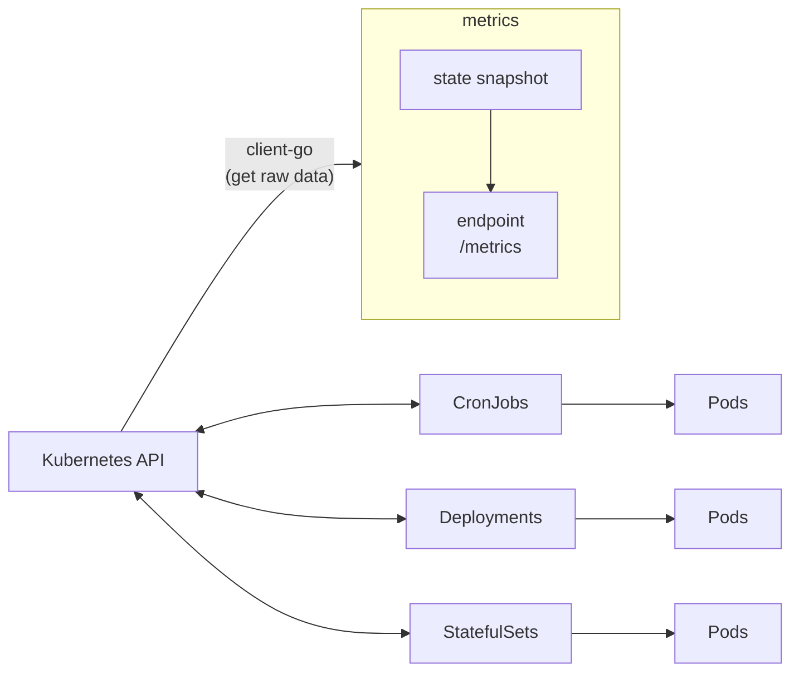

- 2023/01/05

# k8s 監控

關於 k8s 監控, k8s 有 2 個互補的 add-ons, 用以 aggregating 及 reporting 監控數據

## Metrics Server(metrics-server)

- [Github-metrics-server](https://github.com/kubernetes-sigs/metrics-server)
- 本身是個 cluster level component
- Metrics Server is a scalable, efficient source of container resource metrics for Kubernetes built-in autoscaling pipelines.
    - 非常的有效率, 每個 Nodes 僅需 2 MiB Memory && 1m CPU
    - 每 15 secs 搜一次 metrics
    - 主要目標是為了實現 k8s 監控架構裡的 core metrics pipelines
- Metrics Server 定期去尻 all k8s nodes 上頭的 kubelet 取得 metrics
    - 保存了 near-real-time metrics in Memory
    - 這些 metrics 都會被 aggregated && 保存在 Memory
    - 僅儲存 latest values
    - 不負責 將 metrics 轉發到其他 third-party destinations
    - 藉由 k8s APISever 的 Metrics API, 將此 metrics expose, 供 Horizontal Pod Autoscaler 和 Vertical Pod Autoscaler 使用
        - 使用 `kubectl top` 其實就是去尻 Metrics API
- Metrics Server is NOT meant for non-autoscaline purpose
    - 不要用它來將 metrics forward 給 monitoring solutions
    - 在這種情況下, 直接從 kubelet 的 `/metrics/resource` Endpoint 來搜集 metrics
- Requirements
    - `kube-apiserver` 需要 enable an aggregation layer
        - 此 aggregation layer 並非 core K8s APIs, 可用來擴展 APIs
    - 還有一大堆要求... https://github.com/kubernetes-sigs/metrics-server#requirements
- 查看是否已安裝 Metrics Server: `kubectl get pods -A | grep metrics-server`

## kube-state-metrics, KSM

- [Github-kube-state-metrics](https://github.com/kubernetes/kube-state-metrics#kube-state-metrics-vs-metrics-server)
- listens to **k8s API Server** && 依照 k8s object state 來 generate metrics
    - 不會對 蒐集到的 metrics 做加工
        - 因此, 蒐集到的 metrics, 可能會與 `kubectl` 取到的 values 不相同
        - kubectl 應用了某些 heuristics 來呈現 comprehensible messages
    - 不會專注於 k8s components 的 health, 而是專注於 objects inside, ex:
        - deployments, nodes, pods, ...
- metrics 預設 expose 到 HTTP Endpoint(8080 port): `/metrics`
    - plaintext
    - 可用來餵給 Prometheus (或 與抓取 Prometheus 兼容的 clients)
    - 此 `/metrics` 揭露了 k8s cluster current state
        - 因此如果 k8s objects 砍了, 在裡面就看不到他了
- 專注於 由 **k8s object state**(ex: Deployments, ReplicaSets) 來 generate 完整的 new metrics
- 會將 k8s state 的 entire snapshot 保存在 memory && 持續 generat new metrics
    - 基本上, 建議(起碼)配置 250MiB Memory && 100m CPU
- 同 metrics-server, 也不負責將 metrics export 到其他地方
- `kube-state-metrics` 預設會將自己的 metrics expose 到 8081 port
    - 可藉由 `--telemetry-host` 及 `--telemetry-port` 修改
- 藉由 `client-go` 與 k8s cluster 溝通

---

上面這張圖應該有點問題, 忘了讀過哪些文件畫出來的... (先保留)

-------------------------------

---

# k8s Resource limits && Resource requests

- 在 k8s CPU 術語, milicores = 豪核
    - [CPU units](https://kubernetes.io/docs/tasks/configure-pod-container/assign-cpu-resource/#cpu-units)
        - 100m == 100 milicores == 0.1 core == 0.1vCPU == 1 AWS vCPU == 1 GCP Core == 1 Azure vCore
            - AWS EC2 的 1 vCPU == 1024m
            - GCP VM 目前還不確定
        - CPU 的最小精度僅能為 `1m`
    - [Memory units](https://kubernetes.io/docs/tasks/configure-pod-container/assign-memory-resource/#memory-units)
        - `128974848, 129e6, 129M, 123Mi` 這些是一樣的配置
    - 對於 k8s 來說, 1 Core 在 single-core / dual-core / 48-core 都是一樣的東西
    - 像是 *Intel Core i7-6700 x 4 cores*, 若有 hyperthreading
        - 則在 k8s 可看到具有 8000m (8 cores, 8 vCPUs)
- Resource limits 以及 Resource requests, 是針對 Pod 之中的 sum(all Containers usage) 來做上下限規範
- k8s 的 `kube-scheduler`, 使用了 *CFS, Completely Fair Scheduler*
    - [CFS](https://www.kernel.org/doc/Documentation/scheduler/sched-design-CFS.txt)
    - 一語概括 CFS 的設計理念: 「ideal, precise multi-tasking CPU" on real hardware」
    - 此 CFS 會盡力確保, no one can steal the CPU from others
- Container Memory Usage > limit
    - 則此 Container becomes a candidate for termination
    - 如果持續性的超標, 則此 Container 會被 terminate
    - Pod STATUS 會出現 `OOMKilled`
- Container Memory request > available
- Pod scheduling 是基於 requests. 因此當 Node 具備足夠的 Memory 時, 才會被安排運行 Pod 在此 Node
    - 如果 Nodes 上頭的資源, 都無法滿足 Memory requests, 則 Pod STATUS 會出現 `Pending`

---

- Memory Usage > (Memory available 或 Memory limit) -> Pod OOM killed
- Memory limit 不要設太高
    - 極端情況下, 可能要不到資源, ex: 
    - 「request 1GiB && limit 4GiB」, 該 Pod 可能被分配到 2GiB available 的 Node 上頭. 但等到 Pod 真的開始要 resource 時, 它也會被 OOM killed
        - 白話文: 我們家每天有 2 碗飯, 你說你平常吃一碗, 餓的時候吃 4 晚. 我就先收留你了, 但你真的餓了的時候開始把我家米飯啃食殆盡的時候, 你會被逐出門外
- Memory request 不要設太低
    - 在一般情況下, 該 Pod 很可能會被驅逐, ex:
    - 「request 64Mib && limit 4GiB」, 但實際使用 2GiB. 已大大超過 request
        - 白話文: 你說你平常只喝 1 瓶水, 渴的時候會喝 10 瓶. 但我看你平常都喝 5 瓶水, 我會認真考慮把你逐出門外
- k8s 使用 `kernel throttling` 來實現 CPU limit

## Control CPU Management Policies on the Node

- [CPU limits and aggressive throttling in Kubernetes](https://medium.com/omio-engineering/cpu-limits-and-aggressive-throttling-in-kubernetes-c5b20bd8a718)
    - (這篇有點深度... 看得不是很懂Orz)
    - k8s 用 CFS quota 機制來實現 limit
    - cgroups 裡頭有幾個配置:
        - `cpu.share`
        - `cfs_period_us`
            - always 100ms
            - 基於 **time period**, 而非 available CPU power
            - scheduler 用此來 reset **used quota**
        - `cfs_quota_us`
            - 用來表示 quota period 的 **allowed quota**
            - 可 > 100ms
- https://v1-22.docs.kubernetes.io/docs/tasks/administer-cluster/cpu-management-policies/
    - 此為 k8s v1.22, 連結可能於未來某天失效
- k8s 的 `kubelet` 預設使用 *CFS quota* 來 enforce CPU limits
    - k8s 用 CFS quota 來實現 CPU limit
    - *CFS, Completely Fair Scheduler quota* 為 linux task 的 default scheduler, 是一種 process scheduler (用來作資源控管啦)
    - 目標是極大化 XCPU 的利用率 && 交互性能(interactive performance)
- CPU 管控政策
    - `kubelet ... --cpu-manager-policy=none` (此為預設)
        - CFS 無法保證資源使用不超限, 因此 pods 可能會在 nodes 四處移動
    - `kubelet ... --cpu-manager-policy=static`
        - 此機制能確保嚴格限制 CPU Resources
        - allows pods with certain resource characteristics to be granted increased CPU affinity and exclusivity on the node
        - The static policy allows containers in Guaranteed pods with integer CPU requests access to exclusive CPUs on the node. This exclusivity is enforced using the cpuset cgroup controller
            - 不懂這句話意思, 似乎是說, 這種政策, 能夠讓 requests 整數顆 CPU 的 **Guaranteed Pods**, 系統上的 *cpuset cgroup controller* 會安排 獨佔式 CPU 給它
    - 需要知道的是, 此政策是在 kubectl 孵化出 new Pod 的時候套用. 因此不會套用到已存在的 Pods
        - 如果要調整政策, 有一系列步驟需要遵照. 遇到再說
- **CPU manager** 會定期透過 CRI 來做 resource updates, 此動作是為了能夠與 cgroupfs 協調 in-memory CPU assignments
    - 而此定期的頻率, 可藉由 `kubelet ... --cpu-manager-reconcile-period` 來做設定
        - 預設等同於 `kubelet ... --node-status-update-frequency`
    - 若需要額外的細部微調, 參考 `kubelet ... --cpu-manager-policy-options`
