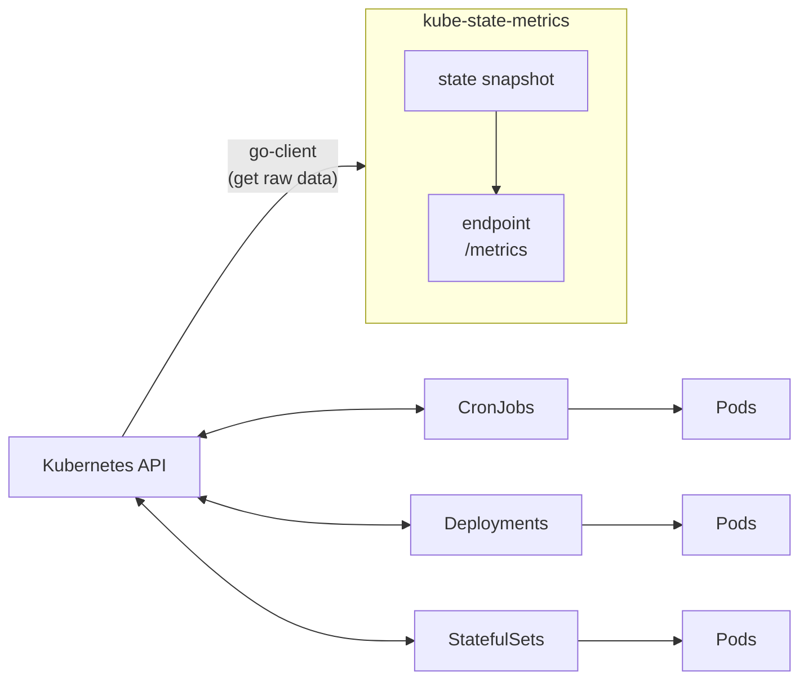
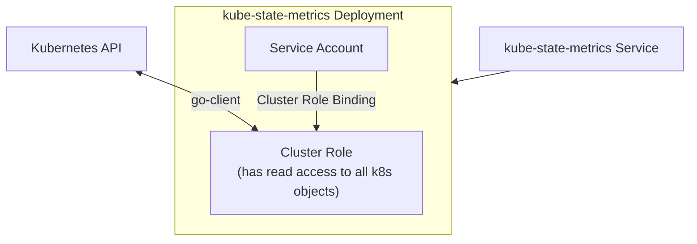

- 2023/01/05

# k8s 監控

- [Github-kube-state-metrics](https://github.com/kubernetes/kube-state-metrics#kube-state-metrics-vs-metrics-server)
- 主要藉由 2 個互補的 add-ons 組建, 用以 aggregating 及 reporting:
    - Metrics Server
        - 本身是個 cluster level component
        - 藉由 Metrics API 定期去尻 k8s nodes 上頭的 kubelet 取得 metrics
    - kube-state-metrics

---

-------------------------------

---

# k8s Resource limits && Resource requests

- 在 k8s CPU 術語, milicores = 豪核
    - [CPU units](https://kubernetes.io/docs/tasks/configure-pod-container/assign-cpu-resource/#cpu-units)
        - 100m == 100 milicores == 0.1 core == 0.1vCPU == 1 AWS vCPU == 1 GCP Core == 1 Azure vCore
            - AWS EC2 的 1 vCPU == 1024m
            - GCP VM 目前還不確定
        - CPU 的最小精度僅能為 `1m`
    - [Memory units](https://kubernetes.io/docs/tasks/configure-pod-container/assign-memory-resource/#memory-units)
        - `128974848, 129e6, 129M, 123Mi` 這些是一樣的配置
    - 對於 k8s 來說, 1 Core 在 single-core / dual-core / 48-core 都是一樣的東西
    - 像是 *Intel Core i7-6700 x 4 cores*, 若有 hyperthreading
        - 則在 k8s 可看到具有 8000m (8 cores, 8 vCPUs)
- Resource limits 以及 Resource requests, 是針對 Pod 之中的 sum(all Containers usage) 來做上下限規範
- k8s 的 `kube-scheduler`, 使用了 *CFS, Completely Fair Scheduler*
- Container Memory Usage > limit
    - 則此 Container becomes a candidate for termination
    - 如果持續性的超標, 則此 Container 會被 terminate
    - Pod STATUS 會出現 `OOMKilled`
- Container Memory request > available
- Pod scheduling 是基於 requests. 因此當 Node 具備足夠的 Memory 時, 才會被安排運行 Pod 在此 Node
    - 如果 Nodes 上頭的資源, 都無法滿足 Memory requests, 則 Pod STATUS 會出現 `Pending`

## Control CPU Management Policies on the Node

- https://v1-22.docs.kubernetes.io/docs/tasks/administer-cluster/cpu-management-policies/
    - 此為 k8s v1.22, 連結可能於未來某天失效
- k8s 的 `kubelet` 預設使用 *CFS quota* 來 enforce CPU limits
    - *CFS, Completely Fair Scheduler quota* 為 linux task 的 default scheduler, 是一種 process scheduler (用來作資源控管啦)
    - 目標是極大化 XCPU 的利用率 && 交互性能(interactive performance)
- CPU 管控政策
    - `kubelet ... --cpu-manager-policy=none` (此為預設)
        - CFS 無法保證資源使用不超限, 因此 pods 可能會在 nodes 四處移動
    - `kubelet ... --cpu-manager-policy=static`
        - 此機制能確保嚴格限制 CPU Resources
        - allows pods with certain resource characteristics to be granted increased CPU affinity and exclusivity on the node
        - The static policy allows containers in Guaranteed pods with integer CPU requests access to exclusive CPUs on the node. This exclusivity is enforced using the cpuset cgroup controller
            - 不懂這句話意思, 似乎是說, 這種政策, 能夠讓 requests 整數顆 CPU 的 **Guaranteed Pods**, 系統上的 *cpuset cgroup controller* 會安排 獨佔式 CPU 給它
    - 需要知道的是, 此政策是在 kubectl 孵化出 new Pod 的時候套用. 因此不會套用到已存在的 Pods
        - 如果要調整政策, 有一系列步驟需要遵照. 遇到再說
- **CPU manager** 會定期透過 CRI 來做 resource updates, 此動作是為了能夠與 cgroupfs 協調 in-memory CPU assignments
    - 而此定期的頻率, 可藉由 `kubelet ... --cpu-manager-reconcile-period` 來做設定
        - 預設等同於 `kubelet ... --node-status-update-frequency`
    - 若需要額外的細部微調, 參考 `kubelet ... --cpu-manager-policy-options`
