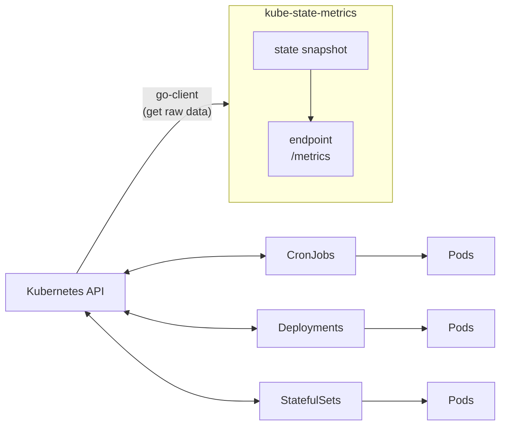
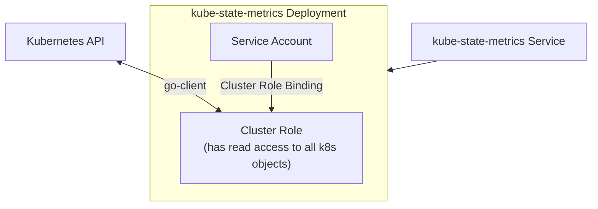

# k8s 監控

- 2023/01/05
- [Github-kube-state-metrics
](https://github.com/kubernetes/kube-state-metrics#kube-state-metrics-vs-metrics-server)

---

- 主要藉由 2 個互補的 add-ons 組建, 用以 aggregating 及 reporting:
    - Metrics Server
        - 本身是個 cluster level component
        - 藉由 Metrics API 定期去尻 k8s nodes 上頭的 kubelet 取得 metrics
        - 
    - kube-state-metrics

---

-------------------------------

---