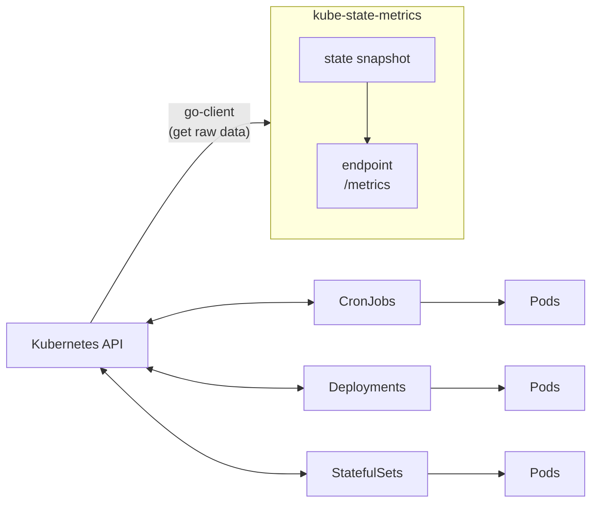
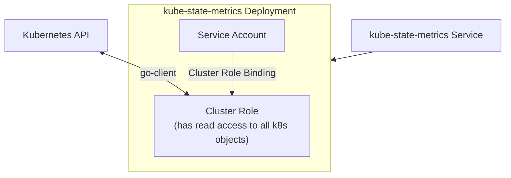

# k8s 監控

- 2023/01/05
- [Github-kube-state-metrics
](https://github.com/kubernetes/kube-state-metrics#kube-state-metrics-vs-metrics-server)

---

- 主要藉由 2 個互補的 add-ons 組建, 用以 aggregating 及 reporting:
    - Metrics Server
        - 本身是個 cluster level component
        - 藉由 Metrics API 定期去尻 k8s nodes 上頭的 kubelet 取得 metrics
        - 
    - kube-state-metrics

---

-------------------------------

---

# k8s Resource limits && Resource requests

- 在 k8s CPU 術語, milicores = 豪核
    - [CPU units](https://kubernetes.io/docs/tasks/configure-pod-container/assign-cpu-resource/#cpu-units)
    - 100m == 100 milicores == 0.1 core == 0.1vCPU == 1 AWS vCPU == 1 GCP Core == 1 Azure vCore
        - AWS EC2 的 1 vCPU == 1024m
        - GCP VM 目前還不確定
    - CPU 的最小精度僅能為 `1m`
    - 對於 k8s 來說, 1 Core 在 single-core / dual-core / 48-core 都是一樣的東西
    - 像是 *Intel Core i7-6700 x 4 cores*, 若有 hyperthreading
        - 則在 k8s 可看到具有 8000m (8 cores, 8 vCPUs)
- k8s 的 `kube-scheduler`, 使用了 *CFS, Completely Fair Scheduler*
    - CFS 是一種 process scheduler (用來作資源控管啦)
        - CFS 無法保證資源使用不超限, 因此 pods 可能會在 nodes 四處移動
        - 如果要確保嚴格限制 Resources, 則需要調整 kubelet
            - `kubelet ... --cpu-manager-policy=static`
                - 預設為 `kubelet ... --cpu-manager-policy=none`
            - 