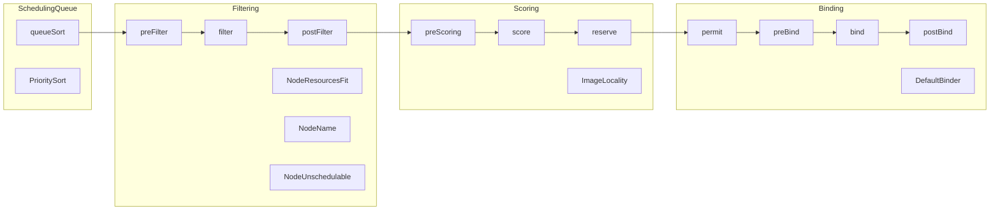

---

## Configuring Scheduler Profiles (不懂)

Extension Points 

```mermaid
flowchart LR

subgraph SchedulingQueue
    queueSort
    PrioritySort;
end
subgraph Filtering
    preFilter --> filter0["filter"] --> postFilter
    NodeResourcesFit;
    NodeName;
    NodeUnschedulable;
end
subgraph Scoring
    preScoring --> score --> reserve;
    NodeResourcesFit;
    ImageLocality;
end
subgraph Binding
    permit --> preBind --> bind --> postBind;
    DefaultBinder;
end

queueSort --> preFilter;
postFilter --> preScoring;
reserve --> permit;
```

---