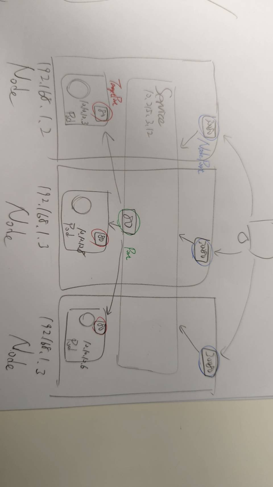

k8s 的 Pods 都有它自己的 IP (ephemeral), Pod 隨時死給你看, IP 隨時可能會變動

- Service 有一組 Static IP, 用來讓 User 與 Service 後面的 Pods 做通訊
    - User 不用鳥 Pods 死活, Service 會幫忙通訊就對了
    - ReplicaSet 會協助幫掛掉的 Pods 抓交替
- Service 的域名表示方法為: `<servicename>.<namespace>.svc.<clusterdomain>`
    - clusterdomain: 為 k8s cluster 設置的 域名尾碼, 預設為 `cluster.local`

# k8s service

Kubernetes 有底下 4 種常見的 Service Types:
    - ClusterIP
    - NodePort
    - LoadBalancer
    - ExternalName

## type: ClusterIP

- 此為 default service type
- Cluster 裡頭的任何 Pod 都可以訪問
- 可指定 1~N 個 Node IP, 用來提供服務 (自動映射到 ClusterIP)

## type: NodePort

- 可將 Cluster Port 映射到 宿主機的 port (宿主機防火牆開了以後, 可對外提供服務)
- 會對所有的 Nodes 都對外提供服務
- 沒給 port, 預設等同於 targetPort
- 沒給 nodePort, 會使用 NodePort 的隨機一個可用範圍 30000-32767
- 而下圖的 `type: NodePort`, 如果用雲服務, 可改成 `type: LoadBalancer`

## type: LoadBalancer

- 於 Public Cloud 使用
- mapping 到 Cloud LB

## type: ExternalName

- 將 Service 映射為一個 external address
- 藉由 `externalName` 來設置

# 