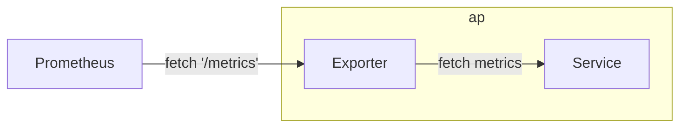
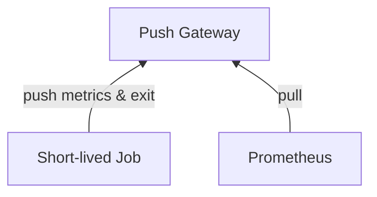
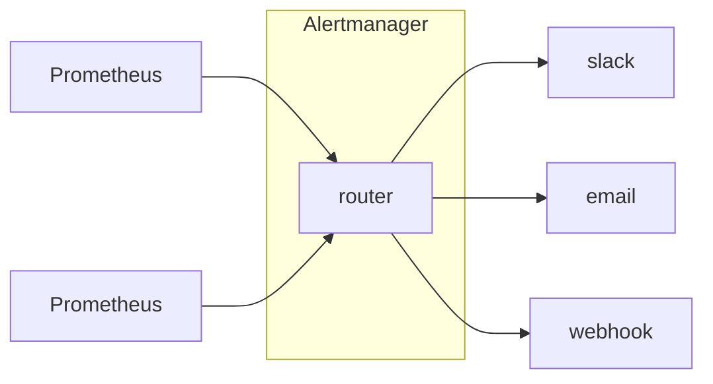

# Prometheus

- Prometheus server 對 agent 做 pull metrics. Agent 揭露 監控物件(target) 的方式如下:
    - 靜態檔案設定
    - 動態發現(Auto Discovery)
        - 目前有支援的系統(藉由自動發現, 取得監控物件):
            - Container Platform : K8s, Marathon
            - Cloud              : EC2, Azure, OpenStack
            - Service            : DNS, ZooKeeper, Consul
- target 狀態:
    - unknown : (一開始被加入時)
    - up      : 成功擷取
    - down    : 擷取失敗 (timeout, ...)
- 使用 `Prometheus query language, PromQL)` 從 k8s 來 filter, aggregate, ingest, and query time series metrics.
- Prometheus 主要有 3 個元件:
    - Retrieval
        - 到處去 pull metrics data, 並存入 TSDB
    - TSDB
    - HTTP Server
        - 提供 API Endpoints
        - 由 TSDB 撈東西後回傳給 Client
    ```mermaid
    flowchart RL

    subgraph Prometheus
        Retrieval
        TSDB
        http["HTTP Server"]
    end

    ui["Prometheus UI"] -- PromQL --> http;
    Grafana -- promQL --> http;
    ```
- Endpoints
    - '/metrics'
    - '/federate'
        - 讓 Prometheus 可以串 Prometheus
    - '/graph'
        - GUI 介面
- Prometheus 指標分類
    - Counter
        - 隨著時間持續增長的指標, ex: 每隔 15 秒一筆
    - Gauge (儀表板)
        - 隨著服務運行而變化的指標, ex: CPU, Memory, Disk Usage, I/O, ...
    - Summary (進階)
        - 可用來判斷一段時間內, 特定指標的分佈狀況
            - ex: `prometheus_tsdb_wal_fsync_duration_seconds{quantile="0.5"}`
        - 使用此類指標時, 無需耗用額外的 Server Side 資源 (Client 負擔較重?)
        - Summary 類型指標一般只適用於 獨立的監控指標
            - 不能再取得平均數 or 連結其他指標
    - Histogram (進階)
        - 反映了 某個時間區間內 的 樣本個數, `le="上邊界"`
            - ex: `http_request_duration_seconds_bucket{le="0.3"}`
        - 

```bash
### Prometheus Metric
<metric name>{<label name>=<label value>, ...}
```


## Exporter

- Prometheus 對於不同 Middleware 開發了許多 監控代理, ex:
    - Kafka exporter
    - MySQL server exporter
    - Apache exporter
    - Redis exporter
    - Node exporter
- 讓 Prometheus scraping metrics 的 AP
- Exporter 可視為是 Service 的 Sidecar




## Push Gateway Component

- Prometheus 基本上是透過 pull 拉 metrics, 但為了與 採用 push 監控系統連線, 則可使用 **PushGateway**.
    - 系統主動發送 metrics 到 PushGateway, Prometheus 再來 pull




## AlertManager

- 用來協助 Prometheus 發送警告資訊
    - 獨立於 Prometheus 的元件
    - 本身支援 HA
- AlertManager 之間避免重複警告, 彼此間引用了 Gossip 來同步 警告資訊



