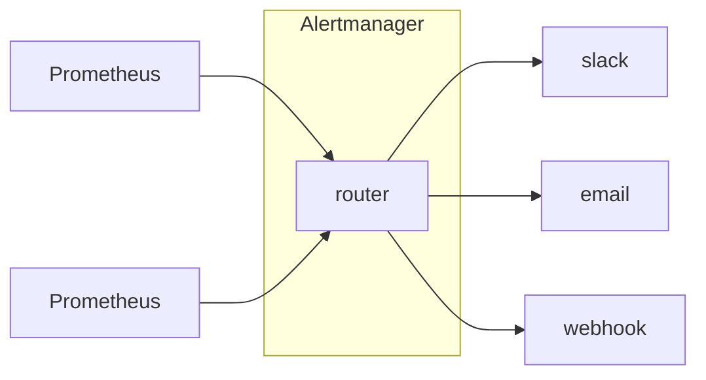

# AlertManager

- [Prometheus - Routing tree editor](https://www.prometheus.io/webtools/alerting/routing-tree-editor/?_gl=1*17xkugl*_ga*MTk2MzAyMzI4My4xNzIwMDc1NjMx*_ga_80ZM8LGB96*MTcyMDc3NTg1NC4xNS4xLjE3MjA3Nzc0NzQuMC4wLjA.)

- 用來協助 Prometheus 發送警告資訊
    - 獨立於 Prometheus 的元件
    - 本身支援 HA
- AlertManager 之間避免重複警告, 彼此間引用了 Gossip 來同步 警告資訊




```bash
### start alertmanager
./alertmanager --config.file=alertmanager.yml
```
