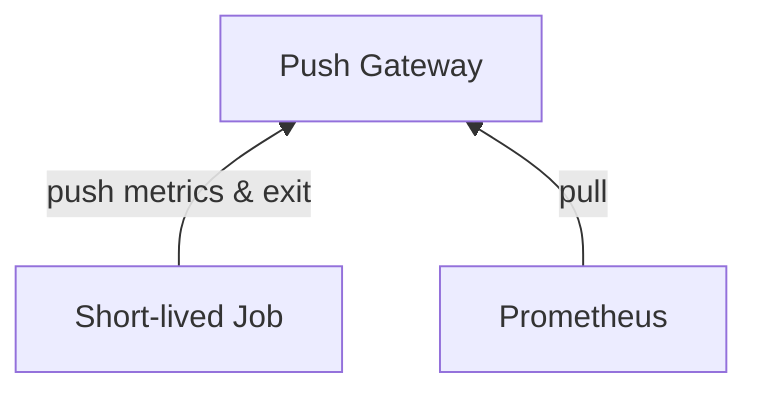

# Push Gateway Component

- Prometheus 基本上是透過 pull 拉 metrics, 但為了與 採用 push 監控系統連線, 則可使用 **PushGateway**.
    - 系統主動發送 metrics 到 PushGateway, Prometheus 再來 pull

```mermaid
flowchart BT

pg["Push Gateway"]
job["Short-lived Job"]

job -- push metrics & exit --> pg;
Prometheus -- pull --> pg;
```
