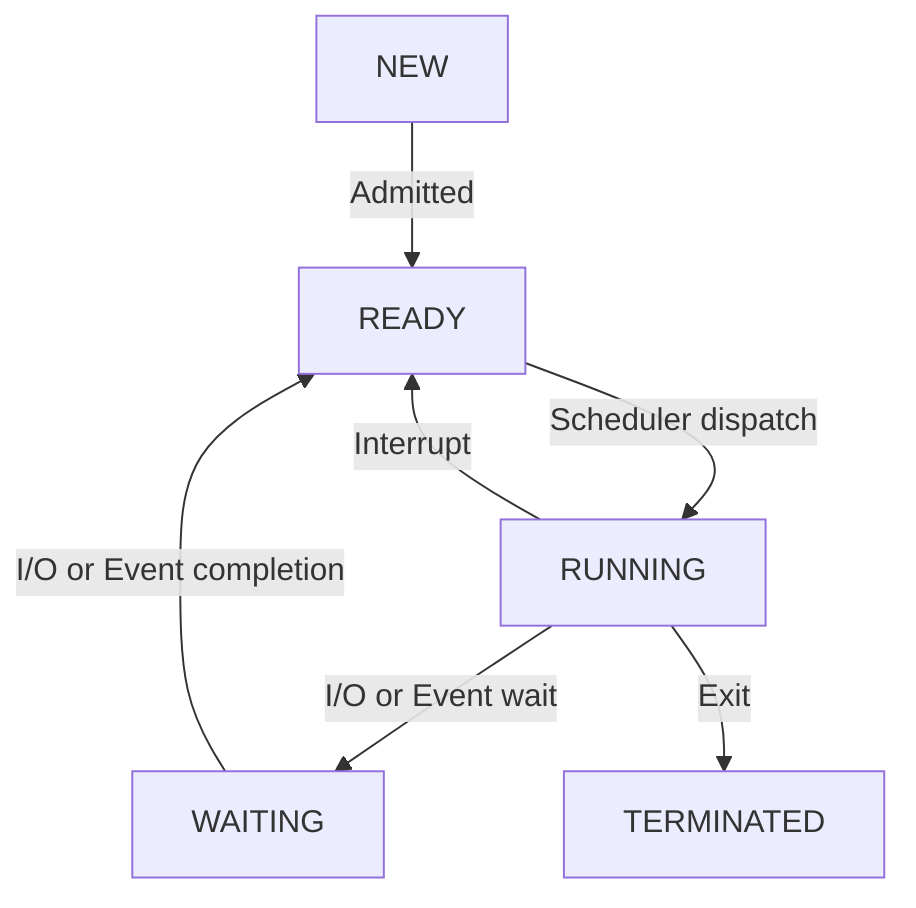

# OS

- mechanism: 怎做
- policy: 做啥

# System call

> 為 OS 提供了 Service 可用的介面

`User mode` 與 `Kernel mode` 切換的時候, 稱之為 `context switching`

可分為 5 大類:

- Process Control
- File Manipulation
- Device Management
- Information Maintenance
- Communication

## Process Control

- end, abort
- load, execute
- create process, terminate process
- get process attributes, set process attributes
- wait for time
- wait event, signal event
- allocate and free memory

## File Manipulation

- create file, delete file
- open, close
- read, write, reposition
- get file attributes, set file attributes

## Device Management

- request device, release device
- read, write, reposition
- get device attributes, set device attributes
- logically attach or detach devices

## Information Maintenance

- get time or date, set time or date
- get system data, set system data
- get process, file, or device attritubes
- set process, file, or device attributes

## Communication

- create, delete communication connection
- send, receive messages
- transfer status information
- attach or detach remote devices

# System program

- File Management
- Status Information
- File Modification
- Programming-language support
- Program Loading and Execution
- Communication

# Process

# Memory management

- fragmentation(碎片化) 分成:
    - external fragmentation(外部碎片化)
        - OS 所有可用記憶體 > 程序所需的記憶體, 但因為 僅存的記憶體空間不連續, 因而無法分配(造成閒置)
        - 解法: 
            - 重組
            - 使用適當的 paging (這是自己看書得到的想法, 但不確定是否正確)
    - internal fragmentation(內部碎片化)
        - OS 分配給程序的記憶體 > 程序實際所需的記憶體, 因此造成不必要的浪費
        - 解法: 降低 page size

