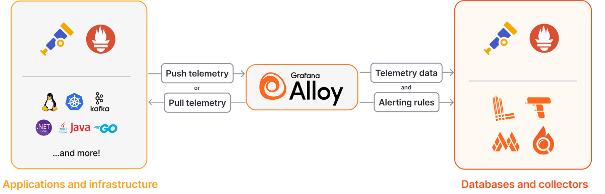

# Grafana Alloy



- Alloy 是個 `OTeL Collector` 的 distribution
  - Alloy 是個 `OTel Proxy`
- Alloy 支援
  - Alloy 支援了 metrics/logs/traces/profiles
  - 可實現一連串的功能: collect, process, export telemetry signals
  - 原生支援 telemetry signals, ex: Prometheus, OpenTelemetry, Loki, Pyroscope
- 由於 Alloy 本身屬於 Grafana 體系, 然後又同時為 OTel Collector, 因此可同時適用於:
  - Loki pipeline
  - OTel pipeline

# Alloy Configuration

```conf
### 寫法
"component_name" "custom_label" {
  arg1 = "val1"
  arg2 = sys.env("ENV_NAME")
  arg3 = component_name.custom_label.arg2.content
}

# 上面這一包, 稱之為一個 Component, 由 Arguments 及 Export 構成
#    Export 則由 component_name + custom_label 組成 (此為 Unique)
#    Arguments 則由 Key = value 組成
# arg2 與 arg3 都是動態參照的寫法
```
