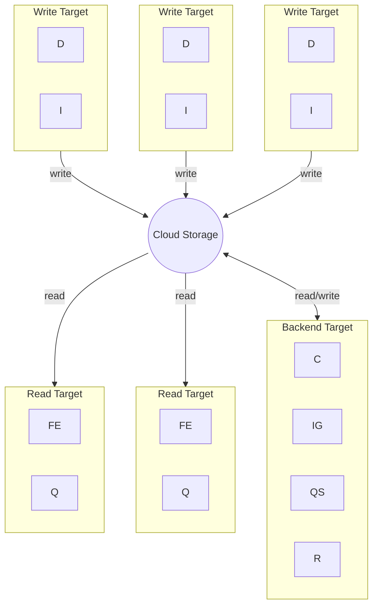

# Loki - Simple scalable mode

| abbr | Components      |
| ---- | --------------- |
| C    | Compactor       |
| D    | Distributor     |
| FE   | Query frontend  |
| I    | Ingester        |
| IG   | Index Gateway   |
| Q    | Querier         |
| QS   | Query Scheduler |
| R    | Ruler           |

