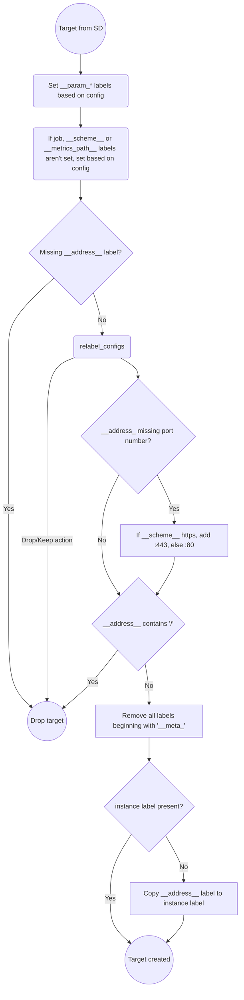

# Targets and Targets Labels come from Service Discovery -- relabel_configs

---

```mermaid
flowchart TB

sd(("Target from SD"))

param("Set __param_* labels based on config")
sd --> param

scheme("If job, __scheme__ or __metrics_path__ labels aren't set, set based on config")
param --> scheme

missing{"Missing __address__ label?"}
scheme --> missing

relabel("relabel_configs")
drop(("Drop target"))
missing -- Yes --> drop
missing -- No --> relabel

relabel -- "Drop/Keep action" --> drop

missingport{"__address_ missing port number?"}
relabel --> missingport

schemeprocess["If __scheme__ https, add :443, else :80"]
missingport -- Yes --> schemeprocess

containsroot{"__address__ contains '/'"}
missingport -- No --> containsroot
schemeprocess --> containsroot

containsroot -- Yes --> drop

meta["Remove all labels beginning with '__meta_'"]
containsroot -- No --> meta

instance{"instance label present?"}
meta --> instance

copy["Copy __address__ label to instance label"]
instance -- No --> copy

created(("Target created"))
instance -- Yes --> created
copy --> created
```

---
