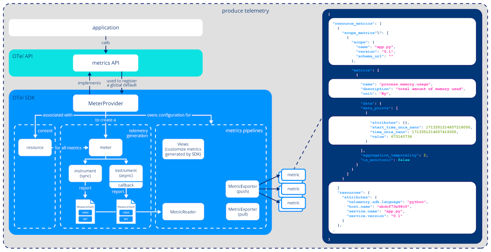

# Metrics



釐清專有名詞: Meter / Instrument / Measurement / Data Point / Metric

```
速記方式:

Meter 建立 Instrument
Instrument 紀錄 Measurement
Measurement 聚成 Data points
Data points 彙成 Metric

管理員（Meter）發給你儀器（Instrument），你每次紀錄都會丟出一張小紙條（Measurement），一堆小紙條被收集後統整成報告（Data point），最後報告都投到一個大資料夾（Metric），讓主管要看什麼就快翻什麼。
```

---

# Types of Measurements

- Counter
  - 單調遞增數值, ex: 累計來訪人數 (只能 +N)
- UpDownCounter
  - 可增減的數值, ex: 現有資料庫連線數 (強制只能用 +N 或 -N, 而非直接回報 M)
- Gauge
  - 當下特定 Measurement 的狀態, ex: 在線人數 (直接回報 M)
- Histogram
  - 用來分析 Distribution of how frequently a value occurs
