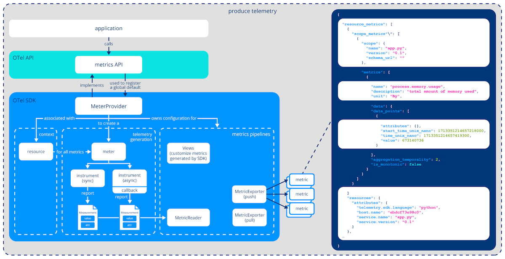

# Metrics

---

# Types of Measurements

- Counter
  - 單調遞增數值, ex: 累計來訪人數 (只能 +N)
- UpDownCounter
  - 可增減的數值, ex: 現有資料庫連線數 (強制只能用 +N 或 -N, 而非直接回報 M)
- Gauge
  - 當下特定 Measurement 的狀態, ex: 在線人數 (直接回報 M)
- Histogram
  - 用來分析 Distribution of how frequently a value occurs
