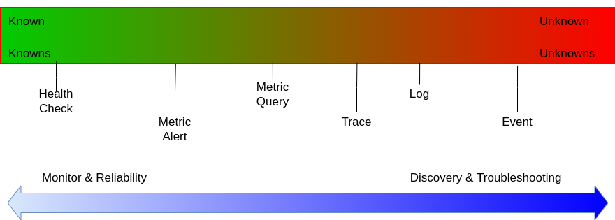

# Monitoring 歷史

- 早期的網路監控(1988s), 當時的熱門協定 SNMP (然而當時它只是個管理網路設備的工具, 並非用於監控), 然而至今已成為網路監控的代名詞.
  - 看一下現代的 SNMP 與 Prometheus, 知名的 Prometheus exporters 之一, 現在則是由 Prometheus 核心團隊維護 SNMP exporter
- 早期的系統監控(1990s), 當時熱門解決方案像是 Nagios, Cacti, Zabbix, ...
  - 本質上都是針對一些 `known unknown` 的問題下去做監控, ex: CPU, Memory, Disk 的使用狀態. 這些監控(原理, 作法)至今幾乎沒有變化
  - 此外, 這種監控假定了 靜態的監控目標 來做處理.
  - 因此早期監控, 聚焦的並非 observable, 而是聚焦在服務正不正常, 僅此而已.

# Observability

https://event.ithome.com.tw/itplus/upload-slide/2024/8/21/3e747970-b99c-40bd-aea7-538817e7ebcf.pdf

- 2019/05, 由 `OpenTracing(CNCF專案)` 與 `OpenCensus(Google開源專案)` 兩大社區宣佈合併 => `OpenTelemetry, OTel`
  - OTel 目的: 提供一個開源的 Observability 的 pluggable 框架
  - OTel 把 Logs/Metrics/Trace 加上 Baggage (在 Span 中傳遞的上下文資訊), 稱為 Signal
  - OTel 專注於資料的 `collection / processing / export`. OTel 本身不負責 資料的儲存
  - OTel 使用官方定義的傳輸協定, OTLP(OpenTelemetry Protocol) 來傳輸 metrics/logs/traces
- Telemetry is the automated communication processes from multiple data sources.
- OpenTelemetry, OTel
  - 觀測性框架
  - 用來建立及管理 traces / metrics / logs 的 toolkit
    - `metrics 及 traces` can be correlated via `exemplars`, and metrics attributes can be enriched via `Baggage` and `Context`.
- 可觀測性(Observability), 並非一個學科所獨有, 早期源自於核能工程, 機器人 (有非常多非常多細節需要去關注)
  - 可觀測性(Observability) 必須透過 `metrics/logs/traces` 來實現
    - 甚至其他學派認為, `events` 也是可觀測性的重要一環 (涉及到 Design Pattern)
    - 並非實現了這 3 項, 就讓系統變得可觀測, 然而這 3 `metrics/logs/traces` 往往是讓系統 可觀測 的重要里程碑
    - 其他的可觀測性, ex:
      - events
        - 依照各種實作, 可能是 logs, 可能是 metrics/logs/traces 的全方位訊號
      - profiles
        - 其實已經存在一段時間了, 近年來以 continuous profiling 的形式成為更加普遍的觀測訊號.
          - 主要原因也是因為 computing 大幅進步 (profiling 相當耗費 CPU)
        - profiling data 看似 trace, 通常包含了 stack traces, application traces
          - 用圖表表達的話, 範例則是 flame graphs
        - profiling 較為知名的 Solution, ex:
          - Parca (from Polar Signals)
          - Thanos (與 Prometheus 相關連的產品)
- 未知的未知(unknown unknowns) : 不存在該指標
- 已知的未知(known unknowns) : Something you are aware but do not know, 可以理解為, 一個已存在的指標, 直到查詢時才知道 its value
- Metrics
  - 最重要的 Metrics 的 4 個切入點: `traffic / errors / saturation / latency`
  - 最基本的監控類型. metric 往往與 time 有關聯, 然而並非 metrics == time series
  - metrics 往往都是 聚合(aggregated) 了某些特定指標, 因而會遺失了特定資訊 (例如聚合了 ResponseTime, 則遺失了每個 Response 挾帶的細節)
    - 這部分得由 logs 來補齊
- Metric 與 TimeSeries
  - Metric, ex:
    - node_memory_MemFree_bytes
  - TimeSeries, ex:
    - node_memory_MemFree_bytes{instance="server1.example.com"}
    - node_memory_MemFree_bytes{instance="server2.example.com"}
  - 因此, 對於每個 Metric, 都可以有成百上千個的 TimeSeries
    - 從 OOP 的角度理解的話, metric 其實是個 base class. 而有非常多的 time series 繼承 metric
      - class Metric: pass
      - class TimeSeriesA(Metric): pass
      - class TimeSeriesB(Metric): pass
      - class TimeSeriesC(Metric): pass
    - 而這些 TimeSeries 與 TimeSeries 之間的差異則在於他們的 metadata, 也就是 labels
- Traces
  - traces 是整個 observability signal 最不失真的指標, 然而往往是最難實踐以及最晚導入到系統的
  - application trace 可以被視為是, 一種自訂 stack trace, 並且只關心自家團隊所寫的 Code path 的所有步驟(流程)
    - 每個 trace 都有 1~N 個 Spans 所構成.
  - tracing 算得上是最昂貴的監控(App 要產生 trace, 必然會有額外開銷)
    - 因此, 針對 tracing data, 並非全部搜集, 而是會做 sampling.
- `Log protocol`
  - 用來 transmitting and storing log messages 的方法
  - Snappy compressed protocol buffer messages

# Observability solutions / Monitoring System

- Alloy
  - Grafana 開源, Written in Go
  - 適用於蒐集 Metrics / Logs / Traces
- Cortex
  - 分散式資料儲存的服務 (如果東西都已經上雲了的話, 不會需要用到 Cortex)
  - 跟 Thanos 互為替代品
- Filebeat
  - 由 Elastic 開源的 Collector. Written in Go
  - 適用於蒐集 metrics / logs / network packet data
  - 較適合用於 Elastic Stack
  - 依賴於 elastic/beats (也就是 libbeat), 相關連的產品有底下這堆:
    - Auditbeat / Filebeat / Heartbeat / Metricbeat / Packetbeat / Winlogbeat / Osquerybeat
- Fluentd
  - 開源的 Log Collector, 適合複雜的 Log Pipeline
- Fluent Bit
  - FluentBit 為 Fluentd 的子專案, 專注在高效能 & 低資源佔用, 講究輕量化.
  - FluentBit 支援 metrics / logs, 也支援 OTel, 適合 Embeded / Kubernetes
- Logstash
  - 由 Elastic 開源的 Collector. Written in Java
  - 適合用於複雜的過濾機制
    - 適用於蒐集 Logs / Events
  - 較適合用於 Elastic Stack
- jaeger
  - 聚焦在分散式系統的請求專宗. 聚焦在 tracing
- Nagios
  - 老牌監控工具, 原名為 NetSaint
  - written by C
  - 主力在於 主機監控 && 網路監控
  - 資料儲存在 `Round Robin Database, RDD` (環狀資料庫)
    - RDD, 為時序資料庫
- Open-Falcon
  - 小米開放原始碼的監控工具
  - written by go
- pprof
  - Go 語言的效能分析工具. 專注於單一應用程式的效能剖析, 聚焦在 profiling.
- Pyroscope
  - 開源的 profiling 工具, 專注在性能分析
- Splunk
  - splunk 是早期的企業級,商業化,大一統 觀測解決方案
  - splunk 是一套以 收集/儲存/搜尋/分析 machine data 為核心的商業及 Observability 與 SIEM(威脅偵測與安全監控) 平台
  - splunk 包含但不限於 Dashboards / Alerting / Reporting
  - 早期以 logs 為主, 後來陸續整合了 metrics/traces
- Telegraf
  - Telegraf 是個開源的 Collect Agent
  - 由 InfluxData 開發, 用於處理 metrics / logs, 階級等同於 Observability 之中的 Collector
- Thanos
  - 分散式資料儲存的服務 (如果東西都已經上雲了的話, 不會需要用到 Thanos)
  - 跟 Cortex 互為替代品
- Zabbix
  - 老牌的 自成一體的 監控系統
- Zipkin
  - 分散式 tracing system
  - 2012 年由 Twitter 開源. 年代久遠, 但相對成熟, 有自成一體的 Collector / Storage / Dashboard
  - OTel 也支援 zipkin 格式
    - app 藉由 zipkin sdk 生成 traceID, 再由 OTel Collector 轉發到 zipkin 或其他 backend(ex: Tempo)

# Monitoring

- 監控範疇
  - Application Level - `Application Performance Management, APM`
    - Call Chain
    - Http Delay
    - Performance
    - Status
  - Middleware Level
    - Cache
    - Message
    - Service
    - DB
  - Infra Level
    - CPU
    - Memory
    - Network
      - 通常基於 `Simple Network Management Protocol, SNMP`
      - 網路效能監控: `Network Performance Monitor, NPM`
    - Storage
    - Disk I/O
    - Java Machine
      - `Java Management Extensions, JMX`
    - Server
      - 針對實體硬體的監控: `Intelligent Platform Management Interface, IPMI`
      - 由 Google 開放原始碼的 cAdvisor 可以取得 host 上所有 Container 的效能指標
        - 其他 Open Source 監控專案另有:
          - Zabbix
          - Open-Falcon
          - Prometheus
- 監控架構
  - 實現方式:
    - 資料取得
      - pull
      - push
      - pull + push
    - 資料傳輸
      - Socket
      - Http
    - 資料儲存
      - RDB
      - No-SQL
        - MongoDB
        - OpenTSDB
        - InfluxDB
          - 如果服務基本上都是 Cloud Native, 那就不要考慮 InfluxDB 了
  - 核心子系統
    - 資料擷取子系統 : extract, filter, process, store
    - 資料處理子系統 : analyze, display, warning, alert, notify, action

# Monitoring CLI Tools

# Dashboard

- 製作 Monitoring Dashboard 的時候的一些應該注重的重點方向 (關注對象是誰來區分)
  - 底層架構的監控(硬體面) USE - https://brendangregg.com/usemethod.html
    - Utilization (資源利用率)
    - Saturation (泛指既定資源無法處理的額外工作的程度, 通常指的是 queued)
    - Errors (Error events 次數)
  - 客戶實際感受 RED - https://grafana.com/blog/2018/08/02/the-red-method-how-to-instrument-your-services/
    - Request rates (服務每秒請求數)
    - Error (請求之中失敗的次數)
    - Duration or Latency (請求所花費的時間)
  - Google SRE 監控重點 - https://sre.google/sre-book/monitoring-distributed-systems
    - Latency
    - Traffic
    - Errors
    - Saturation
