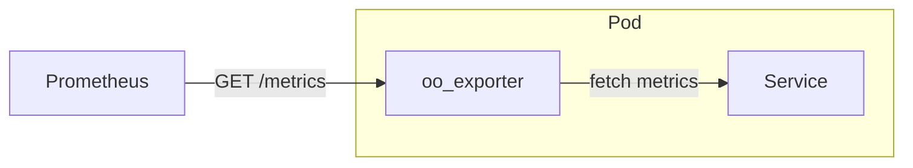

# Prometheus

- 
  - 圖片從這邊來的: https://github.com/prometheus/prometheus/blob/86a7064/documentation/internal_architecture.md
- Prometheus metrics (Prometheus 的 fundamental data type), ex: `node_cpu_seconds_total`
  - Prometheus 的 4 種 Core metric types (這些類型, 不影響 TSDB 的儲存, 僅對於 client 有差異), [詳情看這](./Prometheus-metric-types.md):
    - 計數器(Counters)
    - 量規(Gauges)
    - 直方圖(Histograms)
    - 摘要(Summaries)
- (這個非常無聊, 無聊到這只是個很基本個觀念)Prometheus 的 data model (對於 Client), 分為底下 3 種資料模型的層次:
  - Metric : 只是一個指標, ex: `http_requests_total{method="POST", endpoint="/checkout", status="200"}`
  - Time Series 只是一個時間序列(沒有綁定 metric), ex: 間隔 1 min 的 TimeStamp 的時間序列(無值)
  - Samples : Prometheus 每隔一段時間, 就會去 scrape 所拿到的東西(然後 mapping 到 Time Series)
- Prometheus 由 4 個部分所組成:
  - TSDB
    - TSDB 的核心組件, head block / WAL / data format(blocks, chunks, indices)
  - Scrape manager
  - Rule manager
  - Web UI
- Prometheus server 對 agent 做 pull metrics. Agent 揭露 監控物件(target) 的方式如下:
  - 靜態檔案設定, `static_configs`
  - 動態發現(Auto Discovery), `sd_xxx`
- target 狀態:
  - unknown : (一開始被加入時)
  - up : 成功擷取
  - down : 擷取失敗 (timeout, ...)
- Endpoints
  - `/metrics`
  - `/federate`
    - 讓 Prometheus 可以串 Prometheus
  - `/graph`
    - GUI 介面
- Exporter 可視為是 Service 的 Sidecar
- Prometheus data 儲存成 `dimensional time-series`, 亦即資料有: labels / dimensions / timestamp



- Metric 可以理解成是個 Base Class, TimeSeries 則可視為是 Metric 的 Instance

> Every exporter is comprised of one or more metric definitions, a collector, and a metrics registry.


# Prometheus observability

## Prometheus OTLP receiver

### 1. Prometheus Server 配置:

- Prometheus 支援 OTLP protocol, 預設關閉
- Prometheus 如果要支援 OTLP, 需要帶啟動參數: `--web.enable-otlp-receiver`. 一旦啟用, 那麼就支援 http 及 grpc

### 2. App Client 配置:

```sh
## App client 需要配置環境變數 (才能讓 metrics 成功送達 OTLP receiver)

## 1. 建議明確指定
OTEL_EXPORTER_OTLP_PROTOCOL=grpc # 預設
# 或
OTEL_EXPORTER_OTLP_PROTOCOL=http/protobuf

## 2. Required
PrometheusEndpoint_port=localhost:9090
OTEL_EXPORTER_OTLP_METRICS_ENDPOINT=http://${PrometheusEndpoint_port}/api/v1/otlp/v1/metrics

## 3. Optional
export OTEL_TRACES_EXPORTER=none
export OTEL_LOGS_EXPORTER=none

## 4. Optional
export OTEL_METRIC_EXPORT_INTERVAL=15000
# 預設是 60 secs push metrics, 上例是改成 15 secs

## 5. 建議明確指定
export OTEL_SERVICE_NAME="my-example-service"  # 有些 instrumentation library 目前尚無法支援 service.name, 因此自行定義吧
export OTEL_RESOURCE_ATTRIBUTES="service.instance.id=$(uuidgen)"  # 需確保所有 instance id 都不重複
```


