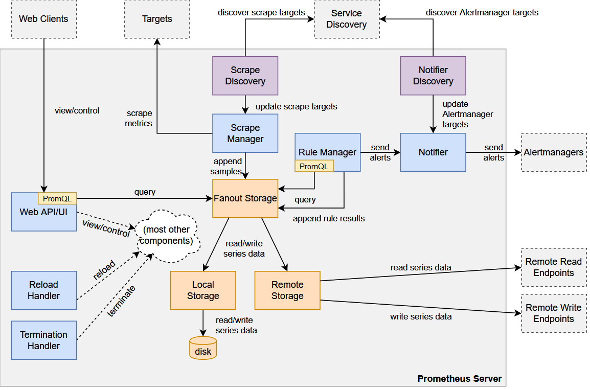
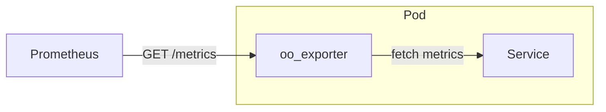

# Prometheus

- 
  - 圖片從這邊來的: https://github.com/prometheus/prometheus/blob/86a7064/documentation/internal_architecture.md
- Prometheus metrics (Prometheus 的 fundamental data type), ex: `node_cpu_seconds_total`
  - Prometheus 的 4 種 Core metric types (這些類型, 不影響 TSDB 的儲存, 僅對於 client 有差異):
    - 詳情看 [Prometheus-metric-types](./Prometheus-metric-types.md)
    - 計數器(Counters)
    - 量規(Gauges)
    - 直方圖(Histograms)
    - 摘要(Summaries)
- (這個非常無聊, 無聊到這只是個很基本個觀念)Prometheus 的 data model (對於 Client), 分為底下 3 種資料模型的層次:
  - Metric : 只是一個指標, ex: `http_requests_total{method="POST", endpoint="/checkout", status="200"}`
  - Time Series 只是一個時間序列(沒有綁定 metric), ex: 間隔 1 min 的 TimeStamp 的時間序列(無值)
  - Samples : Prometheus 每隔一段時間, 就會去 scrape 所拿到的東西(然後 mapping 到 Time Series)
- Prometheus 由 4 個部分所組成:
  - TSDB
    - TSDB 的核心組件, head block / WAL / data format(blocks, chunks, indices)
  - Scrape manager
  - Rule manager
  - Web UI
- Prometheus server 對 agent 做 pull metrics. Agent 揭露 監控物件(target) 的方式如下:
  - 靜態檔案設定
  - 動態發現(Auto Discovery)
- target 狀態:
  - unknown : (一開始被加入時)
  - up : 成功擷取
  - down : 擷取失敗 (timeout, ...)
- Endpoints
  - '/metrics'
  - '/federate'
    - 讓 Prometheus 可以串 Prometheus
  - '/graph'
    - GUI 介面
- Exporter 可視為是 Service 的 Sidecar

- Metric 可以理解成是個 Base Class, TimeSeries 則可視為是 Metric 的 Instance

> Every exporter is comprised of one or more metric definitions, a collector, and a metrics registry.

# exporter
