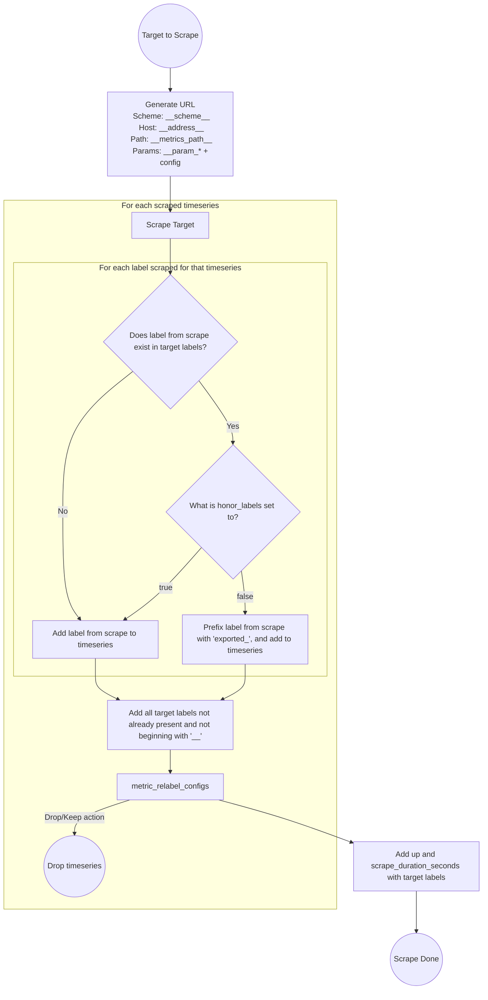

# Labels from scrapes are a mix of Scraped Labels and Target Labels  -- metric_relabel_configs

------------------------------------------------------------------------------------------------

------------------------------------------------------------------------------------------------
