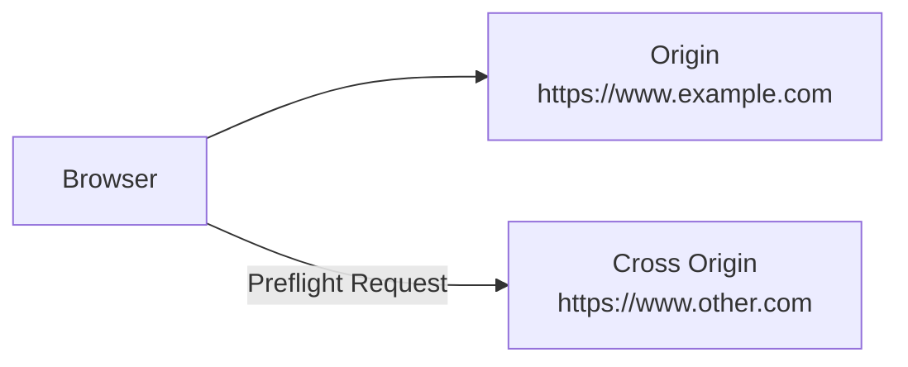
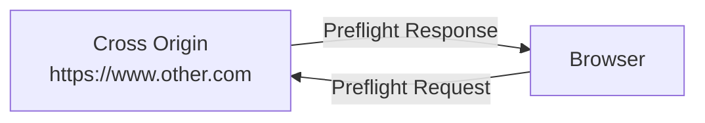
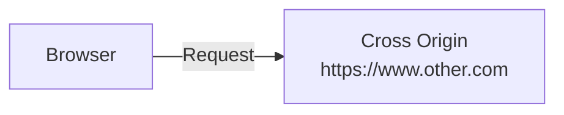
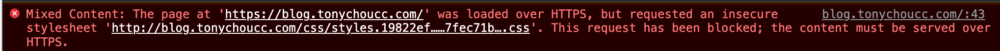

- Origin 為底下 3 個部分組成: scheme + hostname + port  ex: **https://www.example.com:443**
    - https://www.evil.com:443      | cross-origin: different domains
    - https://example.com:443       | cross-origin: different subdomains
    - https://login.example.com:443 | cross-origin: different subdomains
    - http://www.example.com:443    | cross-origin: different schemes
    - https://www.example.com:80    | cross-origin: different ports
    - https://www.example.com:443   | same-origin: exact match
    - https://www.example.com       | same-origin: implicit port number (443) matches
- Site 的定義, 曾經有變動過. 
    - 2019 年前, same-site 的定義 不包含 scheme - 如果 Url 的 domain 皆為 "example.com",         2024 的現在也可稱之為 `scheme-less same-site`
    - 2019 年後, same-site 的定義 　包含 scheme - 如果 Url 的 domain 皆為 "https://example.com", 2024 的現在也可稱之為 `schemeful-site same-site`


# 了解 Sec-Fetch-Site

- [Understanding "same-site" and "same-origin"](https://web.dev/same-site-same-origin/)

`same-site` 與 `same-origin`, 像是在底下的情境, 經常的被混淆:

- context of page transition (頁面轉換)
- iframes
- fetch() request
- cookies
- opening popups
- embeded resources

-------------------------------

## cross-origin

Cross-Origin Resource Sharing, CORS - Access Control Allow Origin

```
https://www.example.com:443
^^^^^   ^^^^^^^^^^^^^^^ ^^^
scheme  hostname        port
```

Same Origin 定義: 有相同的 scheme + hostname

下列 URL 與 https://www.example.com 範例比較:

- https://www.evil.com:443      : cross-origin: different domains
- https://example.com:443       : cross-origin: different subdomains
- https://login.example.com:443 : cross-origin: different subdomains
- http://www.example.com:443    : cross-origin: different schemes
- https://www.example.com:80    : cross-origin: different ports
- https://www.example.com:443   : same-origin: exact match
- https://www.example.com       : same-origin: implicit port number (443) matches


## cross-site

```
            eTLD & site
            vvvvvvvvvvv
https://www.example.com:443
        ^^^^^^^^^^^^^^^
             eTLD+1
```

- https://www.evil.com:443      : cross-site: different domains
- https://login.example.com:443 : same-site: different subdomains don't matter
- http://www.example.com:443    : same-site: different schemes don't matter
- https://www.example.com:80    : same-site: different ports don't matter
- https://www.example.com:443   : same-site: exact match
- https://www.example.com       : same-site: ports don't matter

---------------------------------------------------

IMPORTANT: 底下 2 者的觀念, 是隨著時代演進逐漸轉變:

- 早期 same-site 定義: 不同的 scheme + 相同的 site. ex: *example.com*           => 稱之為 `scheme-less same-site`
- 將來 same-site 定義: 相同的 scheme + 相同的 site. ex: *https* + *example.com* => 稱之為 `schemeful-same-site`

---------------------------------------------------


## 由 HTTP header 識別

早期由 Chrome 實作, 但後來陸續有其他廠商跟進. 使用 `Sec-Fetc-Site`, 有如下結果:

- `cross-site`
- `same-site`
- `same-origin`
- `none`

如此便可透過此 HTTP header, 來辨識

------------------------------------------

`strict-origin-when-cross-origin` 可查看 https://site-one-dot-referrer-demo-280711.ey.r.appspot.com/stuff/detail?tag=red&p=p2


## Cross Origin Request

- https://medium.com/swf-lab/%E7%B6%B2%E9%A0%81%E9%96%8B%E7%99%BC%E5%B8%B8%E8%A6%8B%E4%B9%8B-cors-%E9%8C%AF%E8%AA%A4%E5%8E%9F%E5%9B%A0%E8%88%87-express-%E8%A7%A3%E6%B1%BA%E8%BE%A6%E6%B3%95-bc5eeedea6dc
    - 2024/01/24

Cross Site Request 的請求分成 2 種

簡單請求

- Condition
    - 使用 GET, POST, HEAD 方法之一
    - Content-Type 只能是 text/plain, multipart/form-data, application/x-www-form-urlencoded 其中一種
    - 無自定義 Header
- Browser 發出請求後, 會加上 Request Header: `Origin: your_domain:3000`
- Server 接收後, 返回會加上 Request Header: `Access-Control-Allow-Origin`


非簡單請求


### Step1


```bash
### Preflight Request 內容
OPTIONS /
Host: www.other.com
Origin: https://www.example.com
```


### Step2


```bash
### Preflight Response 內容 
Access-Control-Allow-Origin: https://www.example.com
Access-Control-Allow-Methods: GET, PUT, DELETE
```


### Step3


```bash
### Request 內容 
GET /
Host: www.other.com
Origin: https://www.example.com
```


# Study

- [What is mixed content?](https://web.dev/what-is-mixed-content/)
    - 
    - 