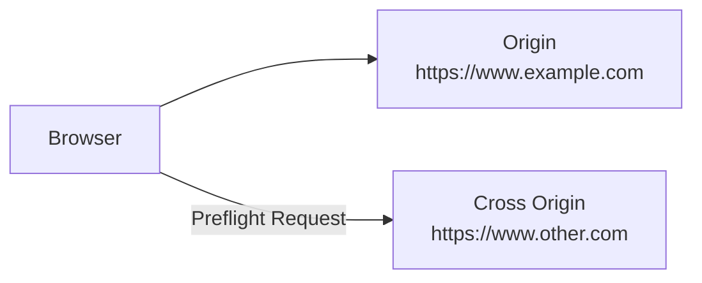
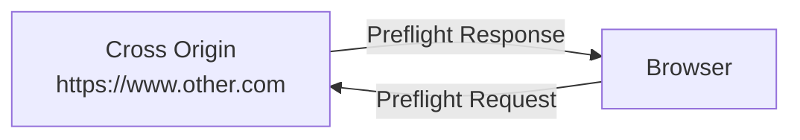
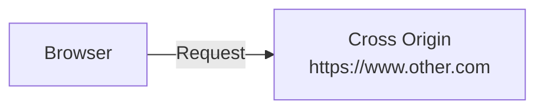
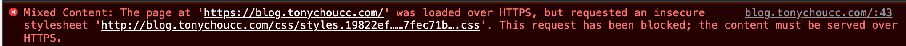

# 關於 same-site 與 same-origin

- [Understanding same-site and same-origin](https://web.dev/articles/same-site-same-origin)
- [Express 解決 CORS](https://medium.com/swf-lab/%E7%B6%B2%E9%A0%81%E9%96%8B%E7%99%BC%E5%B8%B8%E8%A6%8B%E4%B9%8B-cors-%E9%8C%AF%E8%AA%A4%E5%8E%9F%E5%9B%A0%E8%88%87-express-%E8%A7%A3%E6%B1%BA%E8%BE%A6%E6%B3%95-bc5eeedea6dc)
- [strict-origin-when-cross-origin](https://site-one-dot-referrer-demo-280711.ey.r.appspot.com/stuff/detail?tag=red&p=p2)


## 關於 same-origin

Url 若有相同的 scheme://hostname:port 則視為 same-origin

反之, Url 若有不同的 scheme://hostname:port 則視為 cross-origin

---------------------------------------------------------------------

Origin : https://www.example.com:443 則:

- https://www.evil.com:443      : cross-origin: different domains
- https://example.com:443       : cross-origin: different subdomains
- https://login.example.com:443 : cross-origin: different subdomains
- http://www.example.com:443    : cross-origin: different schemes
- https://www.example.com:80    : cross-origin: different ports
- https://www.example.com:443   : same-origin: exact match
- https://www.example.com       : same-origin: implicit port number (443) matches

---------------------------------------------------------------------


## 關於 same-site

Site 的定義, 曾經有變動過

- 2019 年前, same-site 的定義 不包含 scheme, 如果 Url 的 domain 皆為 "example.com",         現今也可稱之為 `schemeless same-site`
- 2019 年後, same-site 的定義 　包含 scheme, 如果 Url 的 domain 皆為 "https://example.com"  現今也可稱之為 `schemeful same-site`

```
            eTLD & site
            vvvvvvvvvvv
https://www.example.com:443
        ^^^^^^^^^^^^^^^
             eTLD+1
```

---------------------------------------------------------------------

Origin : https://www.example.com:443 則:

- https://www.evil.com:443      : cross-site: different domains
- https://login.example.com:443 : same-site: different subdomains don't matter
- http://www.example.com:443    : same-site: different schemes don't matter
- https://www.example.com:80    : same-site: different ports don't matter
- https://www.example.com:443   : same-site: exact match
- https://www.example.com       : same-site: ports don't matter

---------------------------------------------------------------------


## Browser 如何識別: same-site / same-origin / cross-site

多數現代瀏覽器, 會在發送請求時, 加入 Request Header 來做識別:

- Sec-Fetch-Site: cross-site
- Sec-Fetch-Site: same-site
- Sec-Fetch-Site: same-origin
- Sec-Fetch-Site: none


## Cross Origin Request

Cross Site Request 分成 2 種

簡單請求

- Condition
    - 使用 GET, POST, HEAD 方法之一
    - Content-Type 只能是 text/plain, multipart/form-data, application/x-www-form-urlencoded 其中一種
    - 無自定義 Header
- Browser 發出請求後, 會加上 Request Header: `Origin: your_domain:3000`
- Server 接收後, 返回會加上 Request Header: `Access-Control-Allow-Origin`


非簡單請求

(未完)

-----------------

### Step1


```bash
### Preflight Request 內容
OPTIONS /
Host: www.other.com
Origin: https://www.example.com
```


### Step2


```bash
### Preflight Response 內容 
Access-Control-Allow-Origin: https://www.example.com
Access-Control-Allow-Methods: GET, PUT, DELETE
```


### Step3


```bash
### Request 內容 
GET /
Host: www.other.com
Origin: https://www.example.com
```


# Security Headers

## Content Security Policy (CSP)

- 適用於 website with senstive data
- 像是 `XSS(Cross-Site Scripting)` 就是藉由惡意腳本, 鑽進網站漏洞
- `Content-Security-Policy` 提供了一個中間層來限制 script, 藉此緩解 XSS attacks
- 如果是 SSR, 參考 **nonce-based strict CSP**
- 如果是 SPA, 參考 **hash-based strict CSP**


## Trusted Types

- 適用於 website with senstive data
- `DOM-based XSS` 則是使用了像是 `eval()` 或 `.innerHTML`, 將 malicious data 傳送到支援 dynamic code 的地方去執行


## X-Content-Type-Options

- 適用於所有 website
- 例如自家網站裡頭, 被埋了一張 *會被瀏覽器視為是有效 Html* 的圖片, 會被誤判為 valid document, 緊接著被網站的 js 執行
- `X-Content-Type-Options: nosniff`(XCTO) 可避免上述狀況
- 這種機制會將所有的 resources 標記它的 `Content-Type`, 必且會去比對是否為網站所支援的 MIME type (自行理解... 可能有誤)

```ini
### Client Request Header 比需聲明 Content-Type 及 XCTO
X-Content-Type-Options: nosniff
Content-Type: text/html; charset=utf-8
```


## X-Frame-Options

- 適用於所有 website
- 某些 malicious website 可能會 embed your site as an iframe, 藉此來進行攻擊
- 可藉由將 all documents 加入 `X-Frame-Options` 來聲明是否允許 `<frame>`, `<iframe>`, `<embed>`, `<object>`, 來被其他網站 embeded

```ini
### 我這 document 不允許被人家 embeded
X-Frame-Options: DENY
```


## Cross-Origin Resource Policy (CORP)

- 適用於所有 website


## Cross-Origin Opener Policy (COOP)

- 適用於所有 website


## HTTP Strict Transport Security (HSTS)

- 適用於所有 website


## ross-Origin Resource Sharing (CORS)

- Security headers for websites with advanced capabilities


## Cross-Origin Embedder Policy (COEP)

- Security headers for websites with advanced capabilities


# Study

- [What is mixed content?](https://web.dev/what-is-mixed-content/)
    - 
- 如果需要使用 https 在 localhost (或是自訂域名) 用於 local development, 可參考: https://web.dev/articles/how-to-use-local-https
