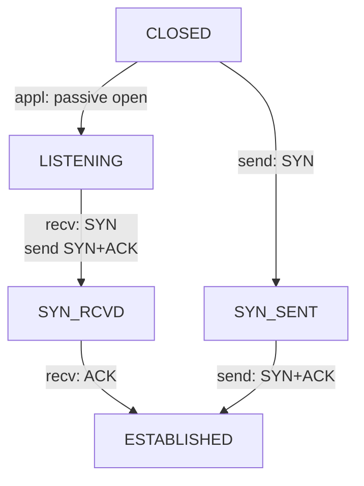

- https://distributedsystemsblog.com/posts/tcp-connection-establish/

---

```mermaid
flowchart TD

closed[CLOSED]
listen[LISTENING]

sent[SYN_SENT]
est[ESTABLISHED]


rcvd[SYN_RCVD]

closed -- "appl: passive open"        --> listen
listen -- "recv: SYN \n send SYN+ACK" --> rcvd
rcvd   -- "recv: ACK"                 --> est
closed -- "send: SYN"                 --> sent
sent   -- "send: SYN+ACK"             --> est
```

---