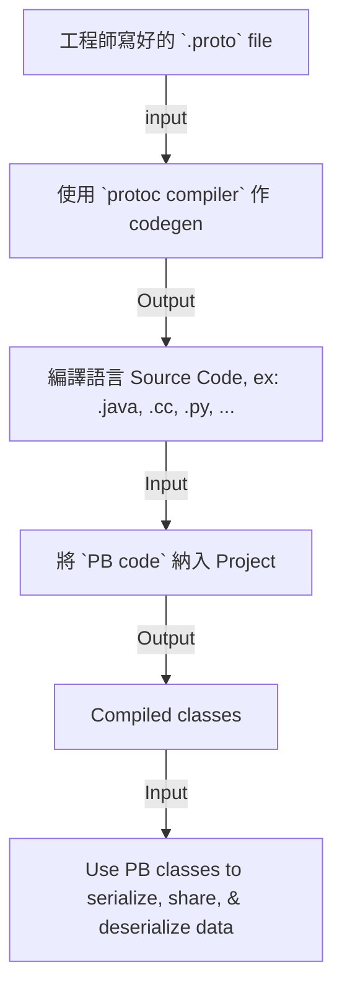

# Protocol Buffers

- [Github-protobuf src](https://github.com/protocolbuffers/protobuf)
- protobuf 通訊協定緩衝區
    - Protocol buffer `messages` and `services` 被工程師定義在 `.proto` 檔案裡頭
    - 是一種用來 serializing structured data 的機制, 好處是:
        - 快
            - compact data storage (緊湊的資料儲存)
            - (因為都是 binary)
        - cross programming language
        - optimized functionality through automatically-generated classes (透過自動生成的類優化功能)
        - A single source of truth
        - Type-Safe
        - 支援 streaming
            - 可取代 RestApi 的三方交握
- 底下這些 Projects 使用了 protocol buffers:
    - gRPC
    - Google Cloud
    - Envoy Proxy
- 如果要安裝 protobuf, 則需安裝:
    - protobuf runtime
    - protocol compiler (此為 `protoc(protocol buffer compiler)`, C++ 寫出來的)
        - 要馬從 C++ src code 做編譯... 不然就直接抓各種語言 compile 出來的 binary, [Github-protobuf](https://github.com/protocolbuffers/protobuf/releases)
            - pre-built binary packages: `protoc-${VERSION}-${PLATFORM}.zip`(ex: `protoc-21.12-osx-x86_64.zip`), 裡頭包含了:
                - bin/protoc
                - 一堆 使用 protobuf 分發出來的 .proto 檔案
        - 對於 golang, 除了電腦上安裝好了 `protoc` 以外, 還需要安裝以下 2 個 protocol compiler plugins for golang:

```bash
# 2023/01
# https://grpc.io/docs/languages/go/quickstart/
go install google.golang.org/protobuf/cmd/protoc-gen-go@v1.28
go install google.golang.org/grpc/cmd/protoc-gen-go-grpc@v1.2

### 並設定好路徑~
export PATH="$(go env GOPATH)/bin:${PATH}"
```

- .proto 定義檔內容
    - Field Labels
        - optional
        - repeated
        - map
        - reserved
            - 盡量不要有 "刪除 Fields" 的動作
            - 如果某些欄位要棄用, 則將這些標記為 reserved (避免 Client 依然使用導致異常)
    - Field Numbers
        - Range: 1 ~ 15 佔用 1 byte
        - Range: 16~2047 佔用 2 byte
        - 合理範圍為 1 ~ 536,870,911 (2^30 - 1)
            - 其中, 19000 ~ 19999 為預設保留段 (勿使用)
        - 一旦定義了以後就不能夠再改變
    - Field Types
        - [scalar type](https://protobuf.dev/programming-guides/proto3/#scalar)
            - int32, int64, sint63, sint64
            - uint32, uint64
            - fixed32, fixed64, sfixed32, sfixed64
            - float, double
        - enumerations type
            - 自訂列舉的概念
        - composite type

```bash
### install
go install google.golang.org/protobuf/cmd/protoc-gen-go@latest
# 會在 $GOPATH/bin 底下安裝好 protoc-gen-go (此為 binary)

### 由 .proto 產生 protobuf
protoc -I=$SRC_DIR --python_out=$DST_DIR $SRC_DIR/${PROTO_FILE}.proto
```


# Protocol Buffers 運作方式


