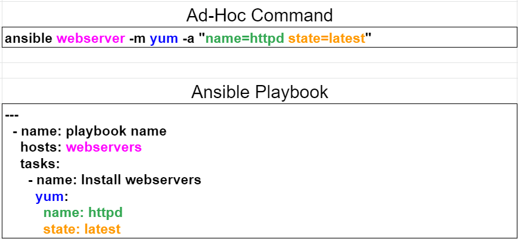

# ansible

- 2020/11


## 基本名詞定義

- ansible 主控端, Control machine, Workstation
- ansible 被控端, Managed node, Server


## Structure

```sh
/etc/
    /ansible/       # ansible 組態目錄
        /ansible.cfg    # ansible 設定主檔
        /hosts          # ansible 自己管理的 主機清單(Host Inventory)
        /roles/
/usr/
    /share/             # 模組位置
$HOME/
    /.ansible/
    /ansible.cfg
        /tmp/           # remote_tmp 及 local_tmp

### 設定檔順序
# Ansible 預設組態主檔 /etc/ansible/ansible.cfg
# 設定檔參考順序為(先找到先適用):
# 1. ANSIBLE_CONFIG (環境變數)
# 2. ansible.cfg (current dir)
# 3. .ansible.cfg (home dir)
# 4. /etc/ansible/ansible.cfg (最後才參考設定主檔)
```


## 觀念

可把 `ansible ad-hoc command` 當成是 Shell Command; `playbook` 當成是 Shell Script.



> A play is an ordered set of tasks which should be run against hosts selected from your inventory.

> A playbook is a text file that contains a list of one or more plays to run in order.


```conf
[defaults]
inventory = hosts

remote_user = vagrant
#private_key_file = ~/.ssh/id_rsa

# host_key_checking
host_key_checking = False
```