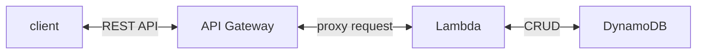
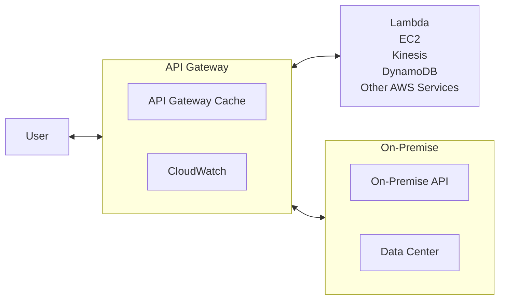
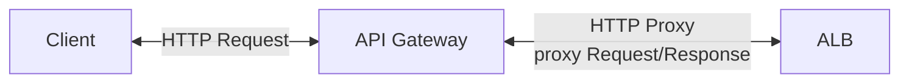

# API Gateway

- [What is Amazon API Gateway?](https://docs.aws.amazon.com/apigateway/latest/developerguide/welcome.html)
    - creating/publishing/maintaining/monitoring/securing ... at any scale
        - REST
        - HTTP
        - WebSocket
- 常見問題: HTTP API v.s. REST API
    - HTTP API, 如果僅需要做 proxy, 使用這個就對了, 成本 ↓ 70% && 效率 ↑ 60%
    - REST API, 相較於 HTTP API, 多了一些功能~ ex: 
        - cache
        - API Keys (認證)
        - usage plans (不知道這啥)
- API Gateway 具備底下功能:
    - handle Security - authentication & authorization
    - throttling
    - cache API Response
    - handle different API versioning
    - handle different environments
    - 後端可放任何 AWS Services

----------------------------------

----------------------------------

----------------------------------


# API Gateway 的 Endpoint Types:

- Edge-Optimized (default) (for global clients)
    - API Gateway 存在於一開始建立的 Region, 不過 Request 會打到 **CloudFront Edge Locations** 再回源
        - improve latency
        - 如果想搞 global services 可考慮這個
    - 如果使用此 Endpoint Type, 又結合 ACM, 則證書會放在 `us-east-1`
- Regional
    - API Gateway 存在於一開始建立的 Region && 預估 clients 也都來自於這個 Region
        - 如果預估 service 限縮於某些地區
        - 也可以自行結合 CloudFront 來做 caching
            - 可自行定義 caching strategy && 將服務擴展到 「非 Global 但是多 Region」
- Private
    - clients from VPC
        - VPC Endpoint (ENI)
    - 訪問權限可使用 Resource Policy 做配置


# API Gateway 的 Integration Types:

## 1. Lambda Function / AWS Service

- 需要自行配置 Integration Request && Integration Response
- 需要配置 mapping templates

```jsonc
// Lambda 回應給 API Gateway 的內容格式需有下列欄位(否則 API Gateway 會拋出 502):
{
    "statusCode": "${httpStatusCode}",
    "headers": { 
        "headerName": "headerValue",
        "otherHeaderKey": "otherHeaderValue"
    },
    "isBase64Encoded": true|false,
    "body": "..."
}
```

## 2. Lambda Proxy

- 將 Client Request 轉變成 Lambda 的 input
- 因而此 Lambda 會變成 Request/Response 的處理邏輯
- 無 mapping template, headers, query string parameters 作為輸入參數


## 3. HTTP Proxy

- 無 mapping template

- HTTP
- Mock
- VPC Link


# API Gateway vs. Load Balancer

- API Gateway : 遊樂園入口的十字轉門
    - 入口 single entrypoint
    - 限流 rate-limiting requests
    - 認證 authenticating
    - 授權 authorization
    - 快取 caching
    - 日誌 logging requests/responses
    - 安全 enforcing security policies
    - 服務發現 service discovery
- Load Balancer : 遊樂園的售票亭
    - **分流 load balancing**
    - 監控 monitoring
    - SSL offloading
    - 壓縮 HTTP Compression
