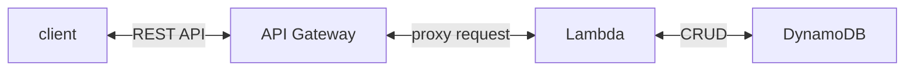
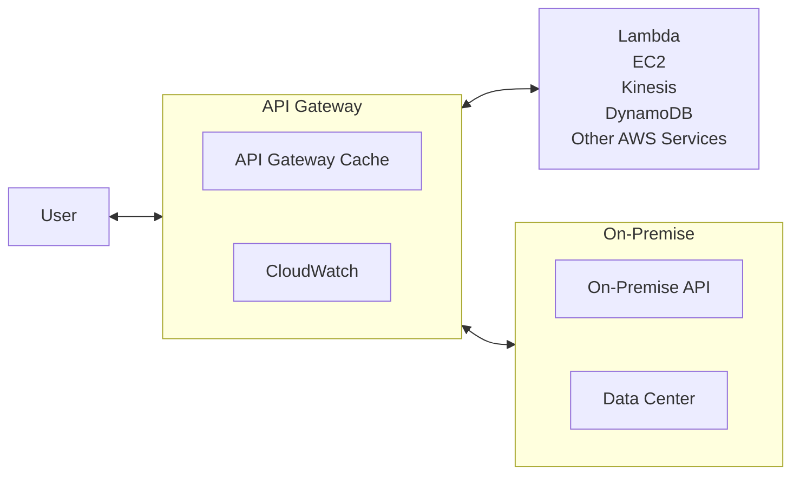
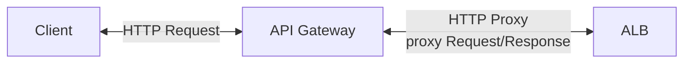

# [API Gateway](https://docs.aws.amazon.com/apigateway/latest/developerguide/welcome.html)

- creating/publishing/maintaining/monitoring/securing ... at any scale
  - REST
  - HTTP
  - WebSocket
- 常見問題: HTTP API v.s. REST API
  - HTTP API, 如果僅需要做 proxy, 使用這個就對了, 成本 ↓ 70% && 效率 ↑ 60%
  - REST API, 相較於 HTTP API, 多了一些功能~ ex:
    - cache
    - API Keys (認證)
    - usage plans (不知道這啥)
- API Gateway 具備底下功能:
  - handle Security - authentication & authorization
  - throttling
  - handle different API versioning
  - handle different environments
  - 後端可放任何 AWS Services
  - RequestValidation
    - 藉由匯入 OpenAPI definition file, 裡頭聲明 `x-amazon-apigateway-request-validator` 來做 Request Validation
  - cache API Response
    - Client 可自行聲明 `Cache-Control: max-age=0` 來告知不要使用 Cache
      - IMPORTANT: 如果以下 2 個動作都沒有做的話, client 可以自行告知不要使用 Cache:
        - 沒有在 Console 上頭 Require authorization check box
      - 沒有配置 InvalidateCache policy

```jsonc
// Api Gateway 允許特定 Resources 讓 Client 自性決定不使用 Cache 的 Polciy setting
{
  "Version": "2012-10-17",
  "Statement": [
    {
      "Effect": "Allow",
      "Action": ["execute-api:InvalidateCache"],
      "Resource": ["arn:...:API_ID/STAGE_NAME/METHOD/RESOURCE_IDENTIFIER"]
    }
  ]
}
```

---



---



---

# API Gateway 的 Endpoint Types:

- Edge-Optimized (default) (for global clients)
  - API Gateway 存在於一開始建立的 Region, 不過 Request 會打到 **CloudFront Edge Locations** 再回源
    - improve latency
    - 如果想搞 global services 可考慮這個
  - 如果使用此 Endpoint Type, 又結合 ACM, 則證書會放在 `us-east-1`
- Regional
  - API Gateway 存在於一開始建立的 Region && 預估 clients 也都來自於這個 Region
    - 如果預估 service 限縮於某些地區
    - 也可以自行結合 CloudFront 來做 caching
      - 可自行定義 caching strategy && 將服務擴展到 「非 Global 但是多 Region」
- Private
  - clients from VPC
    - VPC Endpoint (ENI)
  - 訪問權限可使用 Resource Policy 做配置

# API Gateway - CloudWatch Metrics

常見的 Api Gateway Metrics

- CacheHitCount
- CacheMissCount
- IntegrationLatency : backend 回應給 API Gateway 的時間
- Latency : Client 發送 Request 後, 截至收到 Response 的總時間 (必須 < 29 secs)
- 4XXError
- 5XXError

# API Gateway Pricing

以 ap-northeast-1 為例, 區分成:

- 免費額度 (僅限 AWS 新用戶)
  - HTTP API & REST API - 前 100w 次免費
  - WebSocket API - 用得到再來看
- 計費部分
  - HTTP API (每 512KB 算一次呼叫)
    - 呼叫次數費用
      - 前 0.3 billion 個, 每 1m 費用 USD 1.29
      - 超出部分則為 USD 1.18
  - REST API
    - 呼叫次數費用
      - 前 0.333 billion 個, 每 1m 費用 USD 4.25
      - 到 0.667 billion 個, 每 1m 費用 USD 3.53
        - 後續用得到再說
    - cache 費用
      - 0.5 GB, USD .028/hr
      - 1.6 GB, USD .054/hr
        - 後續用得到再說
  - WebSocket API
    - 用得到再來看

# API Gateway - Integrations:

- Api Gateway 設定好 method 以後, 必須要 integrate it with an endpoint in the backend
- Api Gateway - RestApi(不確定 HttpApi 是否也適用) 的 Integrations:
  - Integration Request 包含了:
    - configuring how to pass client-submitted method requests to the backend
    - configuring how to transform the request data, if necessary, to the integration request data
    - specifying which Lambda function to call, specifying which HTTP server to forward the incoming request to, or specifying the AWS service action to invoke
      - 不管是 Lambda Function 也好, Http Server 也好, AWS Service action 也好, 這些都稱之為 integration endpoint
  - Integration Response (Integration Response, 僅適用於 _non-proxy integrations_) 包含了:
    - configuring how to pass the backend-returned result to a method response of a given status code
    - configuring how to transform specified integration response parameters to preconfigured method response parameters
    - configuring how to map the integration response body to the method response body according to the specified body-mapping templates

## 1. Lambda Function / AWS Service

- 需要自行配置 Integration Request && Integration Response
- 需要配置 mapping templates

```jsonc
// Lambda 回應給 API Gateway 的內容格式需有下列欄位(否則 API Gateway 會拋出 502):
{
    "statusCode": "${httpStatusCode}",
    "headers": {
        "headerName": "headerValue",
        "otherHeaderKey": "otherHeaderValue"
    },
    "isBase64Encoded": true|false,
    "body": "..."
}
```

## 2. Lambda Proxy

- 將 Client Request 轉變成 Lambda 的 input
- 因而此 Lambda 會變成 Request/Response 的處理邏輯
- 無 mapping template, headers, query string parameters 作為輸入參數

## 3. HTTP Proxy

- 無 mapping template



- HTTP
- Mock
- VPC Link

# API Gateway v.s.. Load Balancer

- API Gateway : 遊樂園入口的十字轉門
  - 入口 single entrypoint
  - 限流 rate-limiting requests
  - 認證 authenticating
  - 授權 authorization
  - 快取 caching
  - 日誌 logging requests/responses
  - 安全 enforcing security policies
  - 服務發現 service discovery
- Load Balancer : 遊樂園的售票亭
  - **分流 load balancing**
  - 監控 monitoring
  - SSL offloading
  - 壓縮 HTTP Compression

# Api Gateway - models

# Api Gateway - data transformations - [mapping template](https://docs.aws.amazon.com/apigateway/latest/developerguide/rest-api-data-transformations.html)

- 使用 _Velocity Template Language (VTL)_ 撰寫
- RestApi Gateway 用來將 Api 與 backend 的 path/header/payload 作轉換, 再送給對方
  - 這個 轉換(transform) 通常會依照 models 做一些修改
  - 可能會對 Request 及 Response 做 transform

```vtl
## mapping template 範例
## 可得知, 收到的是一包 [object], object 具備 id, type, price
##
#set($inputRoot = $input.path('$'))
[
#foreach($elem in $inputRoot)
  {
    "description" : "Item $elem.id is a $elem.type.",
    "askingPrice" : $elem.price
  }#if($foreach.hasNext),#end

#end
]
```

# Api Gateway misc

- [自己的 Api Gateway 學習摘要](https://tonychoucc.atlassian.net/browse/DOPS-72)
