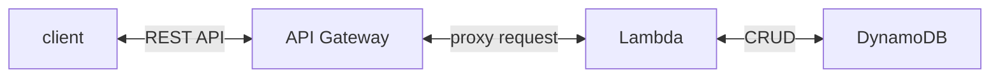
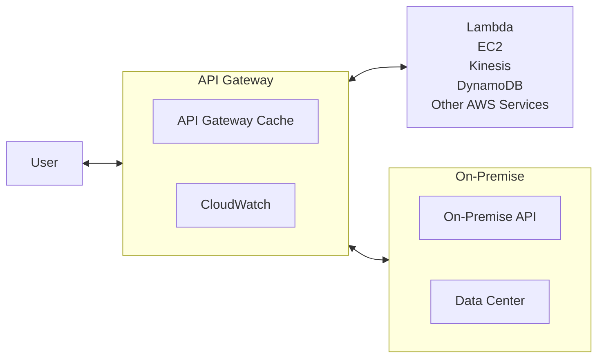

# [API Gateway](https://docs.aws.amazon.com/apigateway/latest/developerguide/welcome.html)

- [Api Gateway 重大事項聲明](https://docs.aws.amazon.com/apigateway/latest/developerguide/api-gateway-known-issues.html)
- [Api Gateway quota 及 notes](https://docs.aws.amazon.com/apigateway/latest/developerguide/limits.html)
- API Gateway 功能:
  - Security - authentication & authorization
  - throttling
  - API Versioning
  - handle different environments
  - 後端可放任何 AWS Services
  - RequestValidation
    - 藉由匯入 OpenAPI definition file, 裡頭聲明 `x-amazon-apigateway-request-validator` 來做 Request Validation
  - cache API Response
    - Client 可自行聲明 `Cache-Control: max-age=0` 來告知不要使用 Cache
      - IMPORTANT: 如果以下 2 個動作都沒有做的話, client 可以自行告知不要使用 Cache:
        - 沒有在 Console 上頭 Require authorization check box
        - 沒有配置 InvalidateCache policy
- **HTTP API Gateway** v.s. **REST API Gateway**
  - HTTP API, 如果僅需要做 proxy, 使用這個就對了, 成本 ↓ 70% && 效率 ↑ 60%
  - REST API, 相較於 HTTP API, 多了一些功能~ ex:
    - cache
    - API Keys (認證)
    - usage plans

---



---



---

# API Gateway 的 Endpoint Types:

- Edge-Optimized (default) (for global clients) `$$$`
  - API Gateway 存在於一開始建立的 Region, 不過 Request 會打到 **CloudFront Edge Locations** 再回源
    - improve latency
  - ACM 證書放在 `us-east-1`
- Regional `$$`
  - custom 若與 Api Gateway 來自於同一個 Region, 則使用這個就對了
    - 另 cross-region 的部分, 可藉由 CloudFront 來做 caching. (自行設定 caching strategy && 將服務擴展到 「非 Global 但是多 Region」)
- Private
  - 從 VPC 訪問, 藉由 VPC Endpoint(ENI), Resource Policy 配置權限

# API Gateway - CloudWatch Metrics

常見的 Api Gateway Metrics

- CacheHitCount
- CacheMissCount
- IntegrationLatency : backend 回應給 API Gateway 的時間
- Latency : Client 發送 Request 後, 截至收到 Response 的總時間 (必須 < 29 secs)
- 4XXError
- 5XXError

# API Gateway Pricing

以 ap-northeast-1 為例, 區分成:

- 免費額度 (僅限 AWS 新用戶)
  - HTTP API & REST API - 前 100w 次免費
  - WebSocket API - 用得到再來看
- 計費部分
  - HTTP API (每 512KB 算一次呼叫)
    - 呼叫次數費用
      - 前 0.3 billion 個, 每 1m 費用 USD 1.29
      - 超出部分則為 USD 1.18
  - REST API
    - 呼叫次數費用
      - 前 0.333 billion 個, 每 1m 費用 USD 4.25
      - 到 0.667 billion 個, 每 1m 費用 USD 3.53
        - 後續用得到再說
    - cache 費用
      - 0.5 GB, USD .028/hr
      - 1.6 GB, USD .054/hr
        - 後續用得到再說
  - WebSocket API
    - 用得到再來看

# API Gateway - Integrations:

- Api Gateway 的 integration 的 types 分為:
  - HTTP
  - HTTP_PROXY
  - AWS
  - AWS_PROXY
  - MOCK
- Api Gateway 的 integration 可區分為:
  - non-proxy integration (又稱為 custom integration)
  - proxy integration
    - **HTTP proxy integration**
      - 若要整合 api backend, "/" Resource path 底下, enable `proxy resource`: `{proxy+}` (ANY method 會自動建立)
- Api Gateway 的 AWS Integration

  - 假若自己找碴... 硬要用這方式來整合 Lambda 的話
    - method request 依照 client 尻 API 的方法選擇 method
    - integration request method 則要選用 POST (到 Lambda Function)
  - Action Type 這個還沒有很清楚在做啥, 但似乎照著做就行了 Orz
    - Use action name
    - Use path override
      - `2015-03-31/functions/arn:aws:lambda:ap-northeast-1:${AWS_ACCOUNT_ID}:function:Calc/invocations`

- 下面這包忘了在說啥鬼= =... (先留著)
  - Api Gateway - RestApi(不確定 HttpApi 是否也適用) 的 Integrations:
    - Integration Request 包含了:
      - configuring how to pass client-submitted method requests to the backend
      - configuring how to transform the request data, if necessary, to the integration request data
      - specifying which Lambda function to call, specifying which HTTP server to forward the incoming request to, or specifying the AWS service action to invoke
        - 不管是 Lambda Function 也好, Http Server 也好, AWS Service action 也好, 這些都稱之為 integration endpoint
    - Integration Response (Integration Response, 僅適用於 _non-proxy integrations_) 包含了:
      - configuring how to pass the backend-returned result to a method response of a given status code
      - configuring how to transform specified integration response parameters to preconfigured method response parameters
      - configuring how to map the integration response body to the method response body according to the specified body-mapping templates

## Proxy Integration

```jsonc
// Lambda/Http proxy integration 的 Response 必須符合此規範 (否則 API Gateway 502):
// https://docs.aws.amazon.com/serverless-application-model/latest/developerguide/sam-property-api-corsconfiguration.html
{
    "statusCode": "${httpStatusCode}",
    "headers": {
        // 下面這些 Access-Control, 官方文件說如果用 proxy integration, 則一定得要有
        "Access-Control-Allow-Headers": "Content-Type",
        "Access-Control-Allow-Origin": "www.example.com",
        "Access-Control-Allow-Methods": "POST, GET",
        "headerName": "headerValue",
        "otherHeaderKey": "otherHeaderValue"
    },
    "isBase64Encoded": true|false,  // 可以無此 key (似乎是, body 裡頭有 encoded 的話才需要用?)
    "body": "..."  // 此為 `JSON Stringify` (並非 Object)
}
```

## Non-Proxy Integration

- Api Gateway 的 method request 需要做一層轉換 (mapping template), 轉成 integration request 給 backend
  - 這個動作稱之為 **data transformations** - [mapping template](https://docs.aws.amazon.com/apigateway/latest/developerguide/rest-api-data-transformations.html)
- 使用 _Velocity Template Language (VTL)_ 撰寫

---

原始請求:

```rest
POST /Seattle?time=morning
day:Wednesday

{
    "callerName": "John"
}
```

藉由 mapping template:

```vtl
#set($inputRoot = $input.path('$'))
{
    "city": "$input.params('city')",
    "time": "$input.params('time')",
    "day":  "$input.params('day')",
    "name": "$inputRoot.callerName"
}
```

轉換成:

```json
{
  "name": "from request body",
  "city": "from query string",
  "time": "from query string",
  "day": "from request header"
}
```

---

###### [mapping 範例 1](https://docs.aws.amazon.com/apigateway/latest/developerguide/integrating-api-with-aws-services-lambda.html#api-as-lambda-proxy-expose-get-method-with-path-parameters-to-call-lambda-function)

- method request, 依照 path parameters 組合出 integration request
- 此範例的 if 用來判斷, URL 若有 `%2F`, 則視為 `/`

```vtl
{
   "a": "$input.params('operand1')",
   "b": "$input.params('operand2')",
   "op": #if($input.params('operator')=='%2F')"/"#{else}"$input.params('operator')"#end
}

{
    "a": "$input.params('operand1')",
    "b": "$input.params('operand2')",
    "op": #if($input.params('operator')=='%2F')"/"#{else}"$input.params('operator')"#end
}
```

# Api Gateway - models

# API Gateway v.s.. Load Balancer

- API Gateway : 遊樂園入口的十字轉門
  - 入口 single entrypoint
  - 限流 rate-limiting requests
  - 認證 authenticating
  - 授權 authorization
  - 快取 caching
  - 日誌 logging requests/responses
  - 安全 enforcing security policies
  - 服務發現 service discovery
- Load Balancer : 遊樂園的售票亭
  - **分流 load balancing**
  - 監控 monitoring
  - SSL offloading
  - 壓縮 HTTP Compression

# Api Gateway 其他

關於 Api Gateway caching

```jsonc
// Api Gateway 允許特定 Resources 讓 Client 自性決定不使用 Cache 的 Polciy setting
// 忘記這包哪來的了
{
  "Version": "2012-10-17",
  "Statement": [
    {
      "Effect": "Allow",
      "Action": ["execute-api:InvalidateCache"],
      "Resource": ["arn:...:API_ID/STAGE_NAME/METHOD/RESOURCE_IDENTIFIER"]
    }
  ]
}
```
