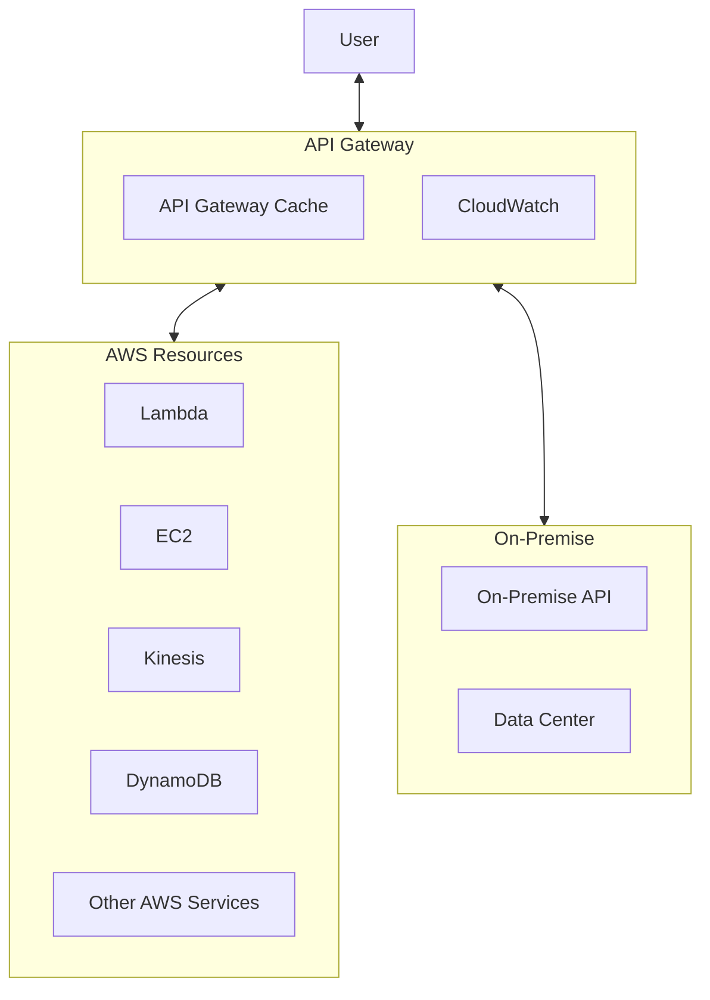

# API Gateway

- [What is Amazon API Gateway?](https://docs.aws.amazon.com/apigateway/latest/developerguide/welcome.html)
    - creating/publishing/maintaining/monitoring/securing REST, HTTP, and WebSocket APIs at any scale.
- 具備底下功能:
    - authentication
    - authorization
    - throttling
    - cache Response
- 具有底下幾種 Endpoint Types:
    - Edge-Optimized (default)
        - API Gateway 存在於一開始建立的 Region, 不過 Request 來自 [CloudFront Edge Locations]
            - improve latency
            - 如果想搞 global services 可考慮這個
    - Regional
        - API Gateway 存在於一開始建立的 Region && 預估 clients 也都來自於這個 Region
            - 如果預估 service 限縮於某些地區
            - 也可以自行結合 CloudFront 來做 caching
                - 可自行定義 caching strategy && 將服務擴展到 「非 Global 但是多 Region」
    - Private
        - clients from VPC
            - VPC Endpoint (ENI)
        - 訪問權限可使用 Resource Policy

