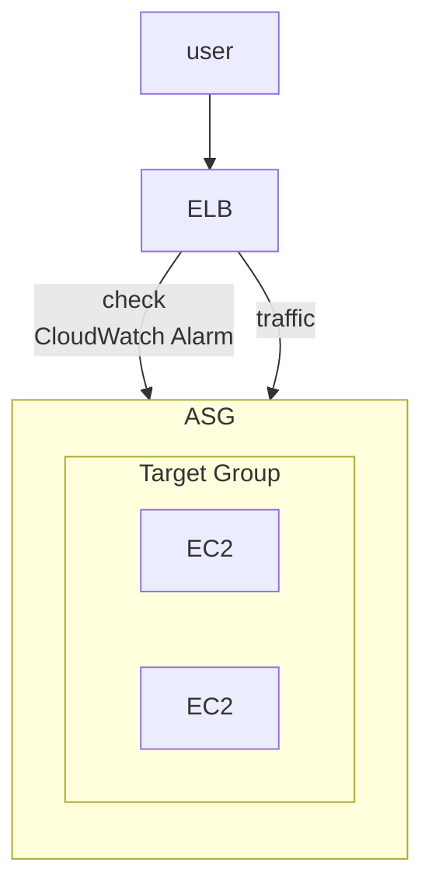
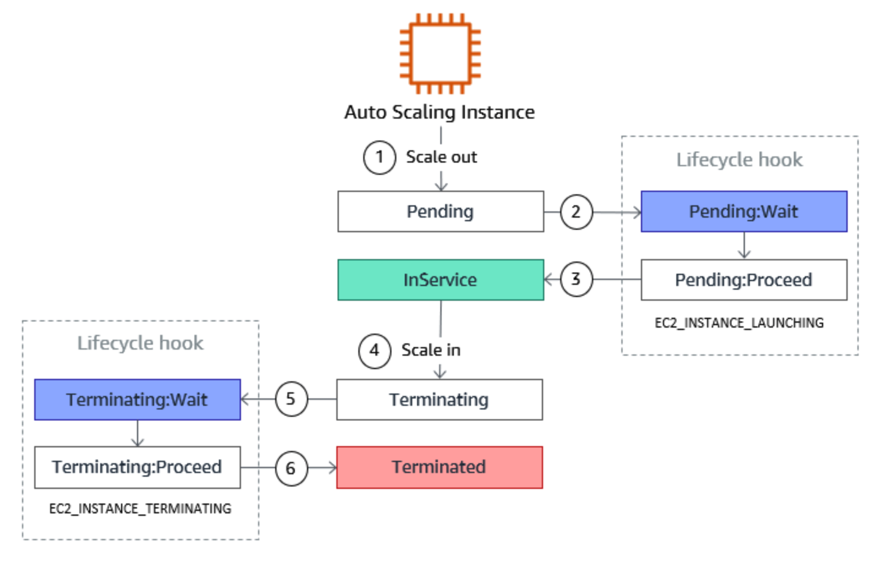

# ASG, Auto Scaling Group

- 針對後端 instance 做 scale out 或 scale in
    - 自動對後端的 Load Balancer 註冊新的 instance
    - ASG 對後端有問題的 instance 執行 terminate (if unhealthy)
        - ALB 則是幫忙做 health check (取代原有的 EC2 status check)
            - 若不健康, ALB 標記為 unhealthy, ASG 再來 terminate && create
- 服務免費, 對後端 Resource 收費
- ELB 能對 ASG 內的 instance 做 Health Check 
    - (疑問, 這個不是 Target Group 做的嗎?)
- 建立 ASG 時, 需先建立 *Launch Template* (OLD *Launch Configuration* 已 Deprecated)
    - 裡頭包含了建立 EC2 instances 的相關必要資訊
        - AMI, Instance Type, EC2 User Data, EBS Volumes, SG, SSH Key, Network, ELB info, ...
    - 需配置 Min Size && Max Size && Initial Capacity && Scaling Policies
        - ASG Scaling Policy 依賴於 [CloudWatch Alarms](./CloudWatch.md#cloudwatch-alarms)
            - 監控特定的 Metrics
    - 比較 *Launch Template* && *Launch Configuration*
        - 兩者一樣都是用來定義 EC2 建置時的必要參數
        - 舊版的 *Launch Configuration* 
            - ex: 修改裡頭參數時, 都需要 重建 instance
        - 新版的 *Launch Template* 
            - 可有不同版本
            - 配置可做 partial configuration(可繼承). 建立 parameter subsets
            - 支援 On-Demand && Spot instance
    - *Launch Configuration* 是 ASG 用來 launch EC2 的 *instance configuration template*
        - 相較於 Launch Template, 無法選擇 multiple instance types
        - 建立後無法修改

# Auto Scaling - Lifecycle Hooks

- [ASG Lifecycle Hooks](https://docs.aws.amazon.com/autoscaling/ec2/userguide/lifecycle-hooks-overview.html)
- ASG 針對 Instance 做 scale (create 或 terminate), 我們可以針對他作業的 Lifecycle 去做 hook
- ex: 機器關機之前, 要把裡頭的配置取出來 OR 機器建置時, 要再額外安裝東西...
- 

# Auto Scaling Mechanism

- 2 種 Scaling 的機制
    - Dynamic Scaling Policies, 又分為 3 種:
        - Target Tracking scaling
            - 最簡單. 只需設定個 baseline
            - ex: 直接設定 average ASG CPU 都維持在 50%
        - Simple Scaling / Step Scaling
            - 藉由 **CloudWatch Alarm** 來做 trigger
            - 需要分別定義 scale in 以及 scale out 的規則, ex: 
                - ASG CPU < 40% 執行 scale in
                - ASG CPU > 70% 執行 scale out
            - Step Scaling 會依據 Alarm 的大小來做 scaling(感覺比較厲害!?)
        - Scheduled Actions
            - 設定特定時段來做 scaling out && scaling in
    - Predictive Scaling
        - auto-scaling service 會持續監控 loading, 預測趨勢來做 scaling
        - 背後借助 ML, 因此可免人工配置相關準則...
- Scaling Policy 還有個叫做 *Cooldown* 的機制, 預設 300 secs. 避免 scaling 機制接連被觸發
- ASG 的 Default Termination Policy(最單純)
    - 會找出不同 AZ 之間, 裡頭最多 instance 的地方, 對裡頭最舊的 instance 做 terminate
