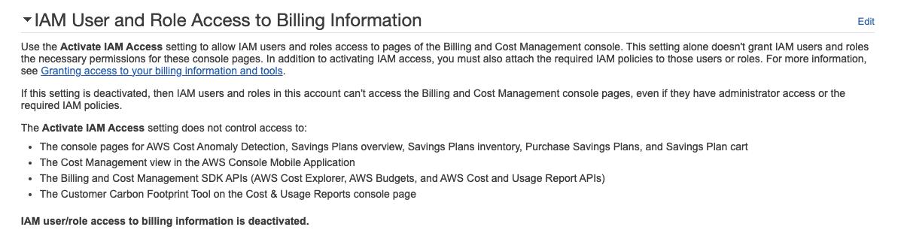

# Compute Savings Plan

- Savings Plans 是種靈活的定價模式, 可自行決定 EC2, Lambda, Fargate 的用量, 並且承諾 1 or 3 年期的使用量. Savings Plans 分為
    - Compute Savings Plans
        - 可節省高達 66%
        - 可自行變更 Instance Type, 並且可更換 Region
    - EC2 Instance Savings Plans
        - 可節省高達 72%
        - 承諾特定 Region && Instance Type 用量

# AWS Budgets

- AWS Budget 的使用費用:
    - 免費額度為 2 Budgets
    - 超過部分, 每個 Budget 每天 0.02, 也就是每個月 0.6 美元
- 建立完帳號以後, 可開個 Budget, 並且配置 alarm, 會在 Cost > Budget 的時候示警
- 有 4 種 Budgets:
    - Usage
    - Cost
    - Reservation
    - Savings Plans

# AWS Billing

- AWS Billing 看到的是 真實成本 (非預估)
- Cost allocation tags **這個很棒!!**
    - (Billing Console) > Cost allocation tags , 可自行選擇啟用哪個 AWS tags, AWS 會自己幫忙標註
- 關於 AWS Billing 及 AWS Cost, 有下列的對應服務可以使用
    - 預估使用成本:
        - Pricing Calculator
    - 追蹤服務成本:
        - Billing Dashboard
        - Cost Allocation Tags
        - Cost and Usage Reports
        - Cost Explorer
    - 監控成本計畫:
        - Billing Ararms
        - Budgets
- 允許 IAM User 看帳單
    - (右上角) > Account > IAM User and Role Access to Billing Information > Edit > Activate IAM Access
        - 
    - 預設只有 root Account 可看
- 如果在 Console > Billing Preferences > Receive Billing Alerts , 需要等 15 mins 才會有資料
- 若想配置 Billing alarms
    - 必須切換到 us-east-1 的 CloudWatch
