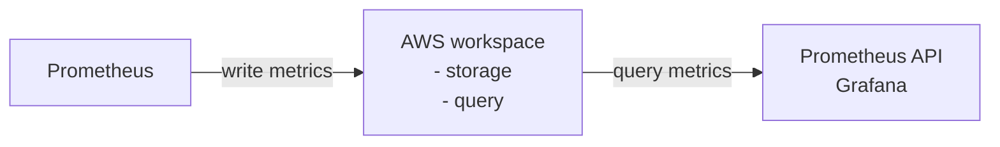

[Amazon Managed Service for Prometheus, AMP](https://docs.aws.amazon.com/prometheus/latest/userguide/what-is-Amazon-Managed-Service-Prometheus.html)

初步理解的示意圖如下

- 玩 AMP 以前, 需要先建 workspace
    - A workspace is a logical space dedicated to the storage and querying of Prometheus metrics.
- Prometheus 分成 3 個元件: Retrieval, TSDB, HttpEndpoint.
    - AMP 應該是用來處理 TSDB(儲存) 及 Endpoint(查詢)
- metrics 預設保留 150 days 以後刪除
