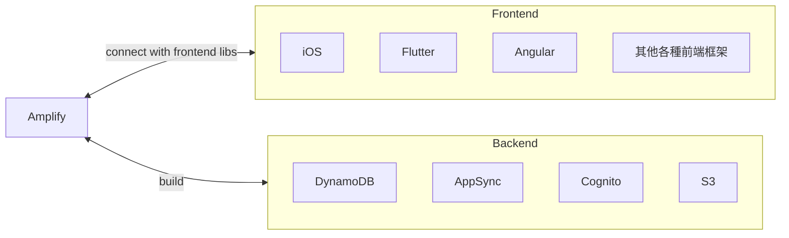
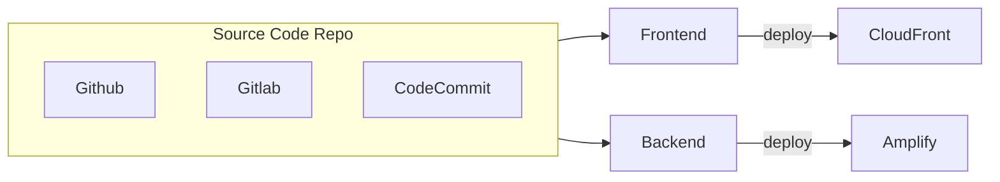

# Amplify

- 可視為用來建 mobile APP && web APP 的 Elastic Beanstalk
- 可以一站處理 web/mobile Applications 的 SaaS

---



---

Amplify Hosting



# CLI

```bash
### init Amplify project
amplify init


### (尚未知)
amplify add hosting


### 新增 Auth
amplify add auth

### 新增 REST/GraphQL API
amplify add api


### Deploy API
amplify push


### Check Amplify's status
amplify status
##    Current Environment: dev
##
##┌──────────┬───────────────┬───────────┬─────────────────┐
##│ Category │ Resource name │ Operation │ Provider plugin │
##└──────────┴───────────────┴───────────┴─────────────────┘
## 輸出


###
amplify console api
```
